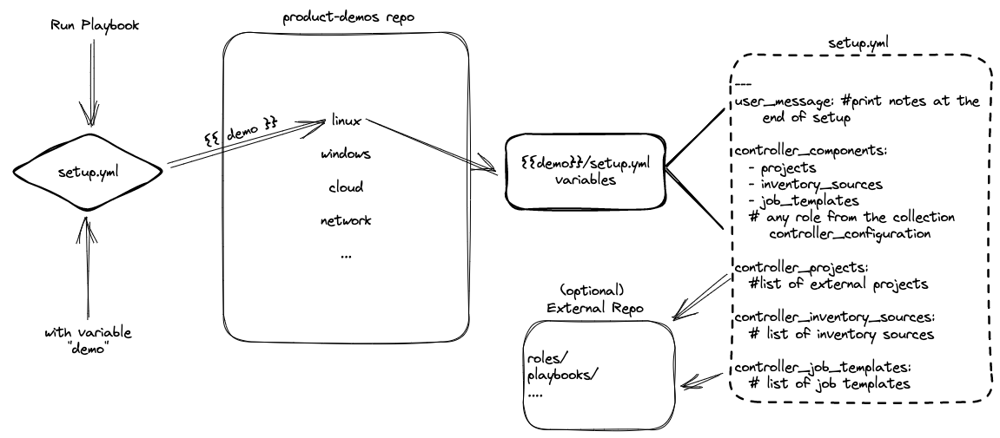

# Contribution Guidelines
This document aims to outline the requirements for the various forms of contribution for this project.

## Project Architecture



## Pull Requests

**ALL** contributions are subject to review via pull request

### Pull Requests
1) Ensure the "base repository" is set to "ansible/product-demos".

#### Pull Request Guidelines
- PRs should include the playbook/demo and required entry in corresponding `<demo>/setup.yml`.
- PRs should include documentation in corresponding `<demo>/README.md`.
- PRs should be rebased against the `main` branch to avoid conflicts.
- PRs should not impact more than a single directory/demo section.
- PRs should not rely on external infrastructure or configuration unless the dependency is automated or specified in the `user_message` of `setup.yml`.

## Adding a New Demo
1) Create a new branch based on main. (eg. `git checkout -b <branch name>`)
2) Add your playbook to the appropriate demo/section subdirectory.
3) Make any changes needed to match the existing standards in the directory.
   1) Ex: Parameterized hosts
   ```ansible
   hosts: "{{ _hosts | default('windows') }}"
   ```
4) Create an entry for your playbook in your subdirectories `setup.yml`
   1) You can copy paste an existing one and edit it.
   2) Ensure you edit the name, playbook path, survey etc.
5) Add any needed roles/collections to the [requirements.yml](/collections/requirements.yml)
6) Test via [demo.redhat.com](https://demo.redhat.com/catalog?item=babylon-catalog-prod/sandboxes-gpte.aap-product-demos.prod&utm_source=webapp&utm_medium=share-link), specify your branch name within the project configuration.

> NOTE: demo.redhat.com is available to Red Hat Associates and Partners with a valid account.

## New Demo Section/Category
1) Create a new subdirectory with no spaces
2) Create a new setup.yml copying appropriate elements from another
   - Below is a sample skeleton for a new setup.yml
    ```ansible
    ---
    user_message: ''

    controller_components:
    - job_templates

    controller_templates:
    ...
    ```
   - `controller_components` can be any of the roles defined [here](https://github.com/redhat-cop/controller_configuration/tree/devel/roles)
   - Add variables for each component listed
3) Include a README.md in the subdirectory

## Testing

We utilize pre-commit to handle Git hooks, initiating a pre-commit check with each commit, both locally and on CI.

To install pre-commit, use the following commands:
```bash
pip install pre-commit
pre-commit install
```

For further details, refer to the [pre-commit installation documentation](https://pre-commit.com/#installation).

To execute ansible-lint (whether within pre-commit or independently), you must configure an environment variable for the token required to connect to Automation Hub. Obtain the token [here](https://console.redhat.com/ansible/automation-hub/token).

Copy the token value and execute the following command:

```bash
export ANSIBLE_GALAXY_SERVER_AH_TOKEN=<token>
```

## Release Process

We follow a structured release process for this project. Here are the steps involved:

1. **Create a Release Branch:**
   - Start by creating a new release branch from the `main` branch.

   ```bash
   git checkout -b release/v-<version>
   ```

2. **Update Changelog:**
   - Open the `CHANGELOG.md` file to manually add your change to the appropriate section.
   - Our changelog follows the [Keep a Changelog](https://keepachangelog.com/en/1.0.0/) format and includes the following categories of changes:

     - `Added` for new features.
     - `Changed` for changes in existing functionality.
     - `Deprecated` for features that will be removed in upcoming releases.
     - `Fixed` for bug fixes.
     - `Removed` for deprecated features that were removed.
     - `Security` for security-related changes.

   - Add a new entry under the relevant category. Include a brief summary of the change and the merge request commit tag.

     ```markdown
     ## [Unreleased]

     ### Added

     - New feature or enhancement ([Merge Request Commit](https://github.com/ansible/product-demos/-/commit/<commit-hash>))
     ```

   - Replace `<commit-hash>` with the actual commit hash from the merge request.

3. **Commit Changes:**
   - Commit the changes made to the `CHANGELOG.md` file.

   ```bash
   git add CHANGELOG.md
   git commit -m "Update CHANGELOG for release <version>"
   ```

4. **Create a Pull Request:**
   - Open a pull request from the release branch to the `main` branch.

5. **Review and Merge:**
   - Review the pull request and merge it into the `main` branch.

6. **Tag the Release:**
   - Once the pull request is merged, tag the release with the version number.

   ```bash
   git tag -a v-<version> -m "Release <version>"
   git push origin v-<version>
   ```

7. **Publish the Release:**
   - After the successful completion of the pull request and merging into the `main` branch, an automatic GitHub Action will be triggered to publish the release.

     The GitHub Action will perform the following steps:
     - Parse the `CHANGELOG.md` file.
     - Generate a release note based on the changes.
     - Attach relevant files (such as `LICENSE`, `CHANGELOG.md`, and the generated `CHANGELOG.txt`) to the GitHub Release.

     No manual intervention is required for this step; the GitHub Action will handle the release process automatically.

8. **Cleanup:**
   - Delete the release branch.

   ```bash
   git branch -d release/v-<version>
   ```
