# How to deploy Ansible Automation Platform via the Operator on CodeReady Containers

This is a quick how to deploy Ansible Automation platform locally on Code Ready Containers for a quick demo, or home lab.

## Definitions

[Red Hat CodeReady Containers aka CRC](https://developers.redhat.com/products/codeready-containers/overview) is a very easy to install local OpenShift cluster that runs on your laptop. This works for any operating system and can be downloaded from [here.](https://developers.redhat.com/content-gateway/rest/mirror/pub/openshift-v4/clients/crc/latest/)

[Ansible Automation Platform (AAP)](https://www.ansible.com/products/automation-platform) is the latest release of what was formerly known as Ansible Tower with many new features.

## CodeReady Containers Installation

Instructions to install crc are [here](https://access.redhat.com/documentation/en-us/red_hat_codeready_containers/1.35/html/getting_started_guide/installation_gsg)

TL;DR if you are on a mac you must be on 10.14 or above and you can just need to run crc binary you installed. (for Linux you will need to install libvirt via ```yum install virt-manager or apt if on debian``` and windows hyper-v must be enabled see install instructions above)

### From terminal

Untar files

  ```shell
  tar -xvf crc-linux-amd64.tar.xz
  ```
  
Copy files to bin

```shell
sudo cp crc-linux-*1.36.0*-amd64/crc /bin/.
```

Run setup

  ```shell
  crc setup
  ```

Increase default cpus so you can run AAP. `Note:` You can sometimes get away with 6, however 8 has worked best for most people

  ```shell
  crc config set cpus 8
  ```
  
Increase default memory so you can run AAP.

  ```shell
   crc config set memory 12288
   ```

Then to run it:

```shell
crc start
```

>>Note: If this is the first time you are installing CodeReady it will ask for a pull secret. You will need to get this from [https://cloud.redhat.com](https://cloud.redhat.com) once logged in choose openshift on the left followed by local install and click copy pull secret and paste it into the terminal.

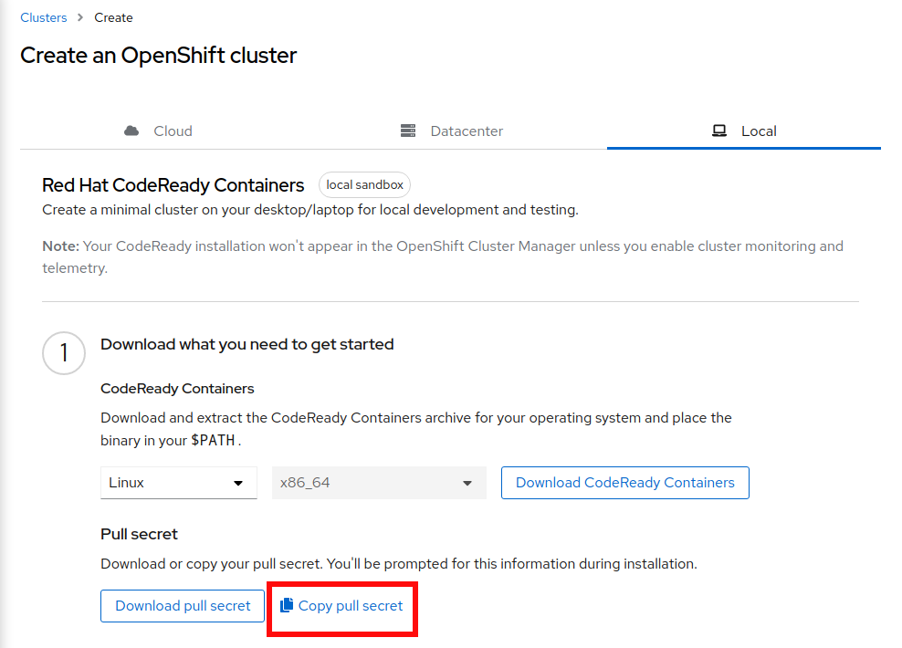

Once it is installed it should give you information to log in, however you can always retrieve this with:

```shell
crc console --credentials
```

## Installing the Ansible Automation Platform Operator

---

## Login to the crc console as kubeadmin

  [https://console-openshift-console.apps-crc.testing](https://console-openshift-console.apps-crc.testing) (get password via ```crc console --credentials``` )

   

---

## Once logged into the CRC/Openshift local instance click on OperatorHub on the left

  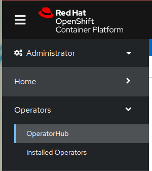

---

### Type Ansible into the filter window and choose Ansible Automation Platform

  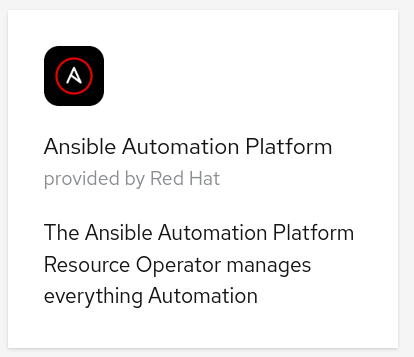

---

## Click install

  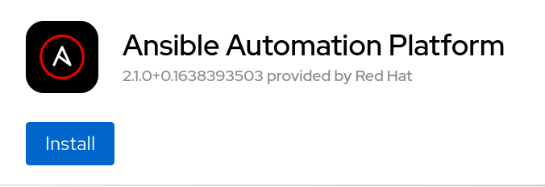

---

## Allow all the defaults and click install again

  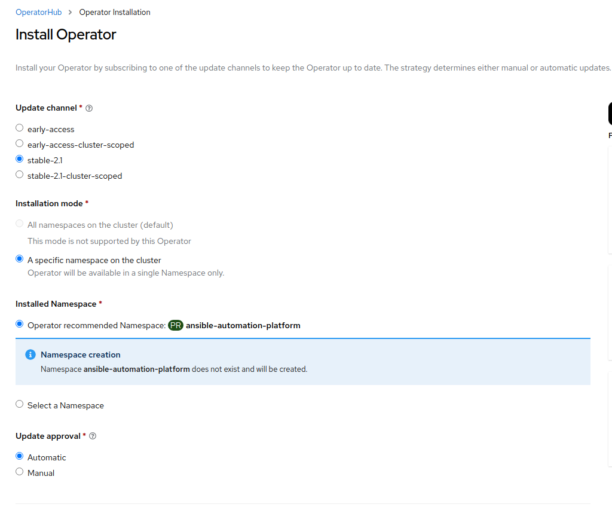

---

## Once it is installed click view operator

  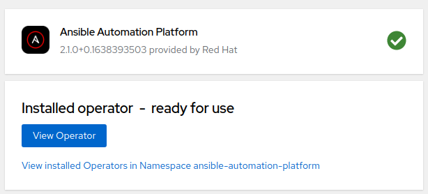

---

## Click Create Instance in the Automation Controller box (third from left)

  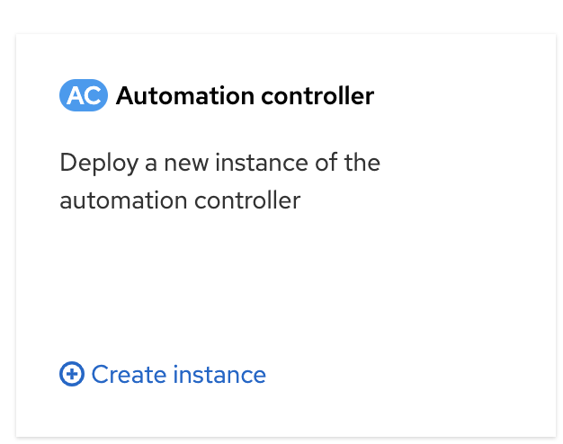

---

## Click Create (you can rename to whatever you want default is example)

  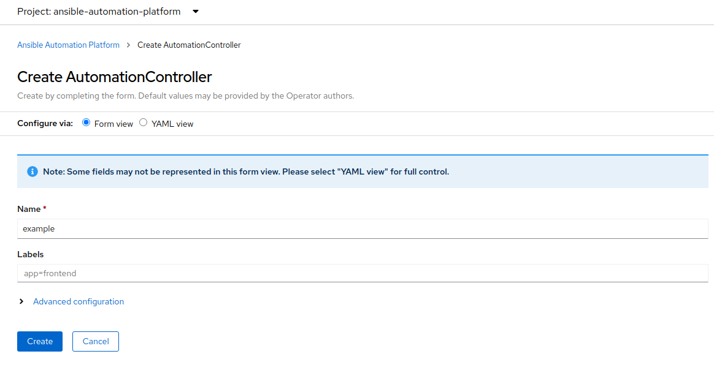

---

## Click on instance you created

  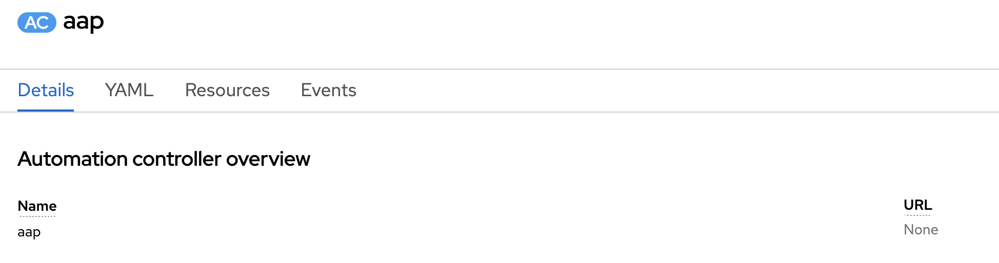

---

## Loging to AAP console (click on URL link on right. The password is in the Admin Password link below the URL)

  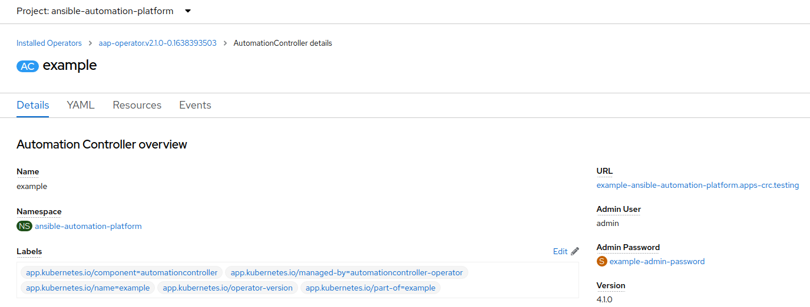

## Add Subscription via your redhat login (if you dont have one click the request trial button at the top)

`Note:` Some users have reported that `request subscription` takes a little time to populate, so if you don't see your trial in the next step please try again a little later.
  
  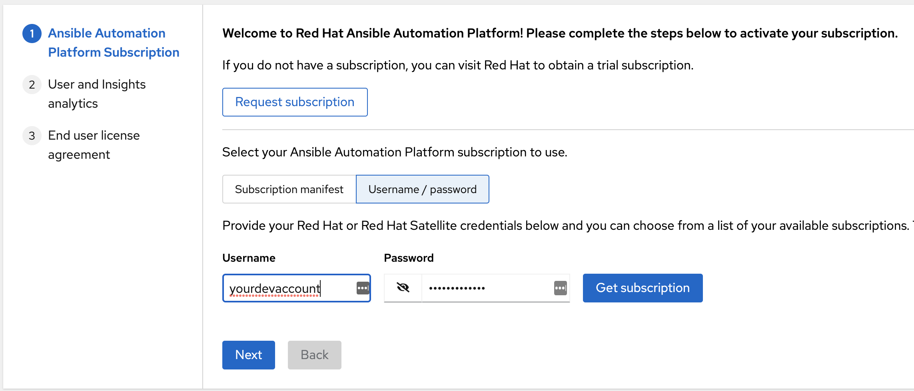

## Select the subscription (then next, next, submit)

  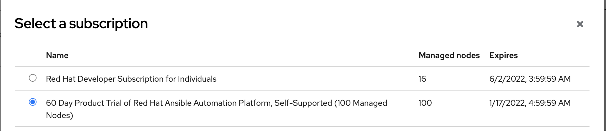

Now you have a fully functional AAP instance to test with.

  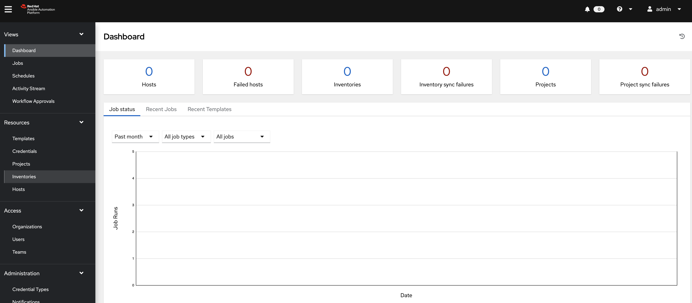

---

## Known Issues and fixes

### AAP Memory Requirements

The AAP operator by default assigns 2gib to each container. Due to this your deployment of AAP may fail with only 12gib assigned to CRC. You can see the failure under pods in the Ansible Automation Project like this:

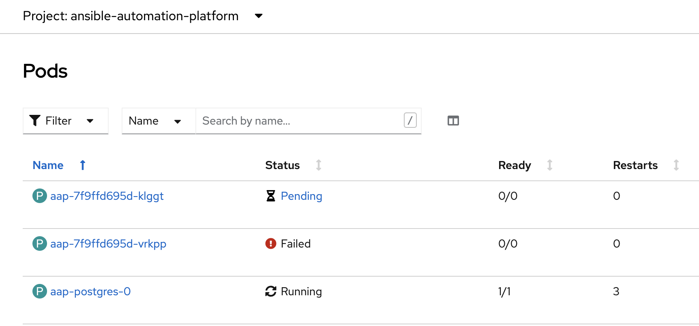

To fix this you have a few options:

1. Add more ram via crc setup set memory 16384
2. Change the memory resource limits to the pod (Deployments >> Edit Resource limits)

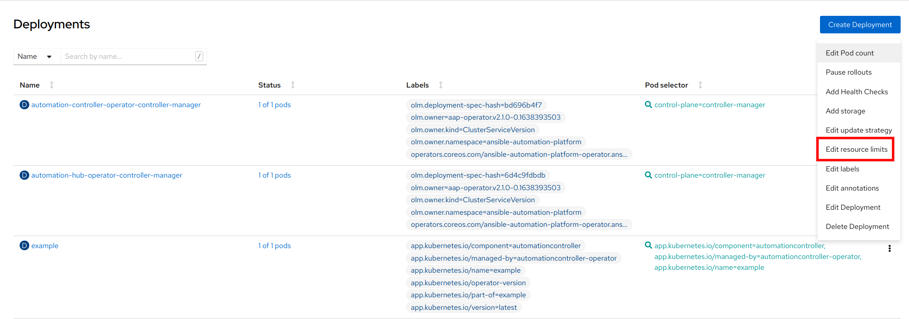

Change to 500 millicores and 1mib like below:

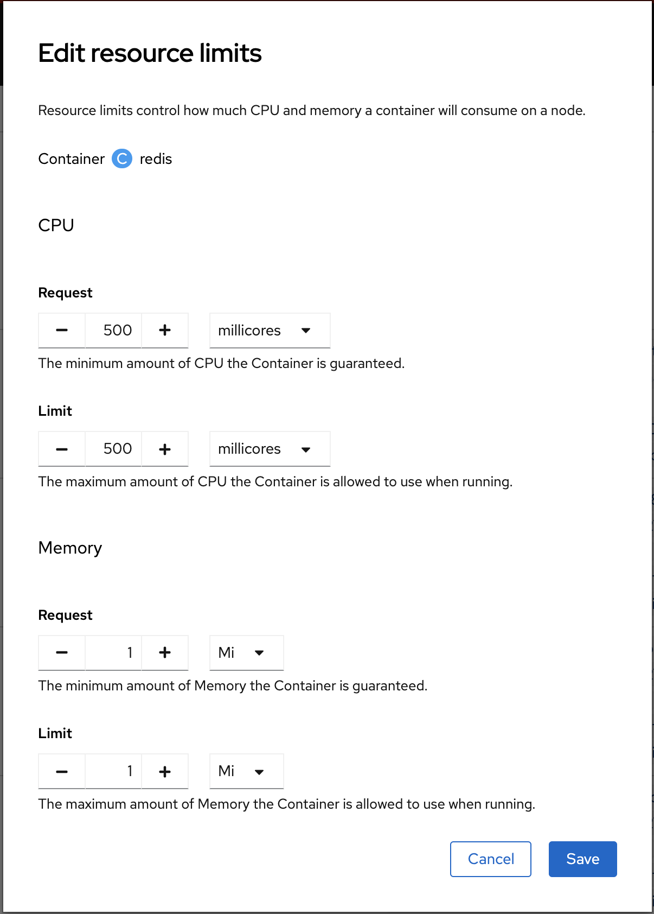
