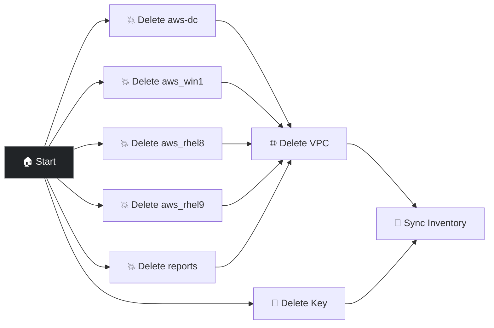

# Destroy Cloud Stack in AWS

Tears down everything created by Deploy Cloud Stack in AWS — terminates all five stack VMs in parallel, deletes the VPC and related networking resources, deletes the keypair, and re-syncs the AWS dynamic inventory so hosts are removed from AAP.

## Prerequisites

- A stack previously deployed with **Deploy Cloud Stack in AWS**
- AWS credential configured

## Survey prompts

| Prompt | Variable | Type | Required |
|--------|----------|------|----------|
| AWS Region | `create_vm_aws_region` | multiplechoice | Yes |

## Workflow

1. Terminates all five stack VMs **in parallel**
2. Deletes VPC `aws-test-vpc` and related resources (subnet, route table, internet gateway, security group)
3. Deletes keypair `aws-test-key`
4. Syncs AWS inventory so hosts are removed from AAP

> **Note:** S3 report buckets created during deploy are not deleted by this workflow.

## Presenter walkthrough

1. **When to use:** Run this at the end of a demo session or when you need to start fresh. It's safe to run even if some VMs are already terminated.
2. **Launch:** Select the same AWS region used for Deploy. The workflow handles everything else.
3. **Watch the parallel teardown:** All five VMs are terminated simultaneously, then VPC and keypair cleanup happens.

## Related demos

| Demo | Description |
|------|-------------|
| 🚀 [Deploy Cloud Stack in AWS](./deploy-cloud-stack.md) | The matching provisioning workflow |
