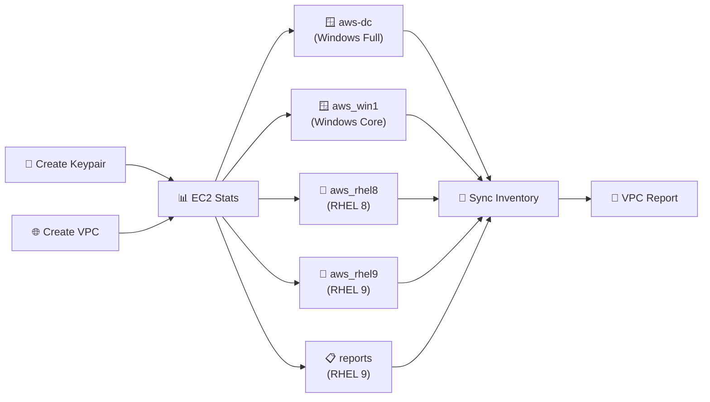

# Deploy Cloud Stack in AWS

Provisions the full demo infrastructure in AWS: VPC, keypair, five VMs (two Windows, two RHEL, one reports server), dynamic inventory sync, and a VPC report published to S3. This is the starting point for most cloud, Linux, and Windows demos.

## Prerequisites

- **If using RHDP (demo.redhat.com):** Run **APD | Multi-demo setup** to configure all templates and credentials. AWS and APD Machine credentials are pre-configured for you.
- **If using your own installation:** Run **APD | Single demo setup** and choose `cloud`. Configure the **AWS** credential with your Access Key and Secret Key, and add an SSH private key to **APD Machine Credential**.

## Survey prompts

| Prompt | Variable | Type | Required |
|--------|----------|------|----------|
| AWS Region | `create_vm_aws_region` | multiplechoice | Yes |
| Owner | `create_vm_aws_owner_tag` | text | Yes |
| Environment | `vm_environment` | multiplechoice | Yes |
| Email | `email` | text | Yes |

## Workflow

1. Creates keypair `aws-test-key` (public key derived from APD Machine Credential private key)
2. Creates VPC `aws-test-vpc` with subnet, security group, and route table
3. Deploys five VMs **in parallel** from blueprints
4. Syncs AWS dynamic inventory so new hosts appear in AAP
5. Publishes VPC infrastructure report to S3

## Why it matters

- Creates a complete demo environment in minutes — no manual AWS console clicking
- Configuration-as-code for infrastructure — the entire stack is defined in playbooks and blueprints
- Mixed OS fleet (RHEL 8, RHEL 9, Windows Server) reflects real customer environments
- Dynamic inventory automatically imports all provisioned VMs into AAP

## Presenter walkthrough

1. **Show the survey:** Walk through each field — region, owner, environment. Explain how surveys make self-service provisioning safe.
2. **Launch:** Start the workflow. As nodes light up, explain the sequence: keypair → VPC → parallel VM creation → inventory sync.
3. **Parallel VM creation:** Point out that all five VMs deploy simultaneously. 'This is the power of workflow nodes — parallel execution with dependency management.'
4. **Inventory sync:** After VMs are created, the dynamic inventory syncs automatically. Show the new hosts appearing in AAP.
5. **VPC report:** Show the S3 report — a visual summary of what was built.
6. **Transition:** 'Now that we have infrastructure, let's do something with it' — pivot to patching, compliance, or other demos.

## Related demos

| Demo | Description |
|------|-------------|
| 🩹 [Patch Cloud Stack in AWS](./patch-cloud-stack.md) | Run this after deploying to demonstrate day-2 patching |
| 💥 [Destroy Cloud Stack in AWS](./cloud-destroy-stack.md) | Tear down everything when done |
| 🐧 [Fact Scan](../../linux/docs/linux-fact-scan.md) | Gather facts from the newly deployed RHEL hosts |
