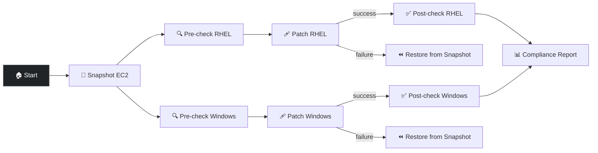

# Patch Cloud Stack in AWS

Enterprise-grade patching workflow with snapshot safety, parallel RHEL and Windows paths, automatic restore on failure, and a consolidated HTML compliance report. Based on jopaik/patch_demo, this workflow covers both operating systems in a single execution against the VMs deployed by Deploy Cloud Stack in AWS.

## Prerequisites

- **If using RHDP (demo.redhat.com):** Run **APD ǀ Multi-demo setup** to configure all demo categories at once, or run **APD ǀ Single demo setup** and choose `cloud` — either option configures the cloud patching templates and credentials. AWS and APD Machine credentials are pre-configured for you.
- **If using your own installation:** Run **APD ǀ Single demo setup** and choose `cloud`. You will also need to configure the **AWS** credential (Access Key + Secret Key), add an SSH private key and Windows username/password to **APD Machine Credential**, and ensure you have the target VMs, VPC, and keypair provisioned.
- Run **Deploy Cloud Stack in AWS** to create the five target VMs (aws_rhel8, aws_rhel9, aws-dc, aws_win1, reports)
- **RHSM Registration credential:** Fill in your Red Hat org ID and activation key (see credential setup below). **Without this, all RHEL patching steps are skipped** — the workflow still succeeds but only Windows hosts actually get patched. RHEL hosts will show as SKIPPED/UNREGISTERED in the output and compliance report.

## Configure credentials before first run

1. **AWS credential** (pre-configured on demo.redhat.com)**:** Navigate to Resources → Credentials → `AWS`. Add your AWS Access Key and Secret Key. This is needed for EBS snapshot and restore operations. *If you ordered your environment from [demo.redhat.com](https://red.ht/apd-sandbox), this credential is already configured for you. You only need to set this up if you are running APD on your own installation (homelab, customer site, etc.).*
2. **APD Machine Credential** (pre-configured on demo.redhat.com)**:** Navigate to Resources → Credentials → `APD Machine Credential`. Add an SSH private key (for Linux connections) and set the username/password (for Windows WinRM connections). *If you ordered your environment from [demo.redhat.com](https://red.ht/apd-sandbox), this credential is already configured for you. You only need to set this up if you are running APD on your own installation.*
3. **RHSM Registration** (action required for everyone)**:** Navigate to Resources → Credentials → `RHSM Registration`. This credential was created by the setup job with placeholder values (`REPLACEME`). Fill in your Red Hat org ID and activation key so RHEL hosts can access advisory repos and get patched. **Without valid RHSM credentials, RHEL patching is completely skipped** — the workflow won't fail, but pre-check, patch, post-check, and rollback all show SKIPPED for RHEL hosts. Only Windows patching proceeds. The compliance report will show RHEL hosts as UNREGISTERED in grey. To find your org ID and create an activation key, visit [console.redhat.com/insights/connector/activation-key](https://console.redhat.com/insights/connector/activation-key).

## Survey prompts

| Prompt | Variable | Type | Required | Default |
|--------|----------|------|----------|---------|
| AWS Region | `aws_region` | multiplechoice | Yes | `us-east-1` |
| RHEL hosts | `_hosts` | text | Yes | `aws_rhel*` (`aws_rhel8`, `aws_rhel9`; not `reports` or `aws_kafka`) |
| Windows hosts | `_hosts_windows` | text | Yes | `aws_win*` (`aws_win1`; not `aws-dc`) |
| RHEL Advisory IDs | `input_cve_ids` | text | Yes | `RHSA-2024:3138, CVE-2024-33599` |
| Windows KB IDs | `input_kb_ids` | text | Yes | `KB5044284, KB5044030` |

## Workflow

1. **Snapshot** — EBS snapshots of all target instances for recovery
2. **Pre-check** (parallel) — Queries advisory/KB applicability on RHEL and Windows
3. **Patch** (parallel) — Applies targeted advisories via `dnf` (RHEL) or `win_updates` (Windows)
4. **Post-check / Restore** — Verifies compliance; on failure, restores from EBS snapshot
5. **Compliance Report** — Generates an HTML dashboard at `http://<reports>/patch_report.html`

## Job templates

| Template | Playbook | Description |
|----------|----------|-------------|
| Cloud ǀ AWS ǀ Snapshot EC2 | [`cloud/snapshot_ec2.yml`](../snapshot_ec2.yml) | Takes EBS snapshots of target EC2 instances |
| Cloud ǀ AWS ǀ Patch Pre-check RHEL | [`cloud/patch_pre_check_rhel.yml`](../patch_pre_check_rhel.yml) | Queries dnf for targeted advisory applicability |
| Cloud ǀ AWS ǀ Patch RHEL | [`cloud/patch_rhel.yml`](../patch_rhel.yml) | Applies specific RHSA/CVE advisories via dnf |
| Cloud ǀ AWS ǀ Patch Post-check RHEL | [`cloud/patch_post_check_rhel.yml`](../patch_post_check_rhel.yml) | Verifies advisories are resolved after patching |
| Cloud ǀ AWS ǀ Patch Pre-check Windows | [`cloud/patch_pre_check_windows.yml`](../patch_pre_check_windows.yml) | Queries Windows Update Agent for targeted KB applicability |
| Cloud ǀ AWS ǀ Patch Windows | [`cloud/patch_windows.yml`](../patch_windows.yml) | Installs specific KB updates via win_updates |
| Cloud ǀ AWS ǀ Patch Post-check Windows | [`cloud/patch_post_check_windows.yml`](../patch_post_check_windows.yml) | Verifies KBs are installed after patching |
| Cloud ǀ AWS ǀ Restore EC2 from Snapshot | [`cloud/restore_ec2.yml`](../restore_ec2.yml) | Restores EC2 volumes from latest EBS snapshot |
| Cloud ǀ AWS ǀ Patch Compliance Report | [`cloud/patch_compliance_report.yml`](../patch_compliance_report.yml) | Generates HTML compliance dashboard on the reports server |

## Why it matters

- Demonstrates day-2 operations at scale — patching is the number one use case customers ask about
- Parallel RHEL and Windows paths show AAP managing heterogeneous environments in one workflow
- Snapshot-based restore provides a safety net that resonates with change-management audiences
- The HTML compliance report is a tangible artifact you can show stakeholders
- Covers targeted advisory patching (RHSA/CVE for RHEL, KB for Windows), not just "update everything"

## Presenter walkthrough

1. **Run setup:** On RHDP (Red Hat Demo Platform), run **APD ǀ Multi-demo setup** to configure everything. On your own install, run **APD ǀ Single demo setup** → choose `cloud`. Then fill in the **RHSM Registration** credential with your org ID and activation key (see credential setup above).
2. **Deploy the stack:** Launch **Deploy Cloud Stack in AWS** to create the five target VMs. Wait for it to complete and verify the hosts appear in inventory.
3. **Set the stage:** Show the audience the five VMs in AAP inventory (aws_rhel8, aws_rhel9, aws-dc, aws_win1, reports). Point out it's a mixed Linux/Windows fleet. The patch workflow targets `aws_rhel*` and `aws_win*` — worker VMs only, not `reports`, `aws_kafka`, or `aws-dc`.
4. **Launch the workflow:** Navigate to Templates → Patch Cloud Stack in AWS. Host patterns default to the worker VMs; fill in a real RHSA/CVE and KB (defaults work). Launch.
5. **Snapshot step:** While it runs, explain that the first node takes EBS snapshots of the target instances — this is the safety net. 'If anything goes wrong during patching, we restore to this point.'
6. **Parallel paths:** Point out the RHEL and Windows pre-checks running simultaneously. 'One workflow, two operating systems, zero extra effort.'
7. **Pre-check results:** Show the debug output — which advisories are applicable, which hosts are already compliant. 'We check before we change.' *Note: If RHSM is not configured, RHEL hosts will show SKIPPED here — this is expected. Without RHSM registration, the hosts can't query Red Hat advisory repos, so all RHEL steps (pre-check, patch, post-check, rollback) are skipped. Windows patching proceeds normally regardless.*
8. **Patching:** The patch nodes apply only the targeted advisories. 'We're not running yum update — we're applying specific CVE fixes with an audit trail.'
9. **Post-check / Restore:** Show the success/failure routing. 'If post-check fails, the workflow automatically restores from snapshot. No manual intervention, no 3am pages.'
10. **Compliance report:** Navigate to http://reports/patch_report.html. Walk through the HTML dashboard — status per host, OS badges, missing advisories, reboot needed. Click the advisory count to expand the full list. 'This is the artifact you hand to your auditor or change board.'

## Talking points

- This is a real-world patching workflow — not a hello-world demo. It mirrors what enterprises actually deploy with AAP.
- The parallel RHEL/Windows paths highlight AAP's ability to manage heterogeneous environments without separate tools.
- Snapshot-before-patch is a pattern customers love — it eliminates the fear of patching production systems.
- Targeted advisory patching (specific CVEs/KBs) versus blanket updates shows precision and auditability.
- The compliance report generates automatically — no separate CMDB integration needed for a quick compliance view.
- Unregistered RHEL hosts are handled gracefully — they show as SKIPPED, not as failures. If someone configures the RHSM credential, they auto-register.

## Related demos

| Demo | Description |
|------|-------------|
| 🚀 [Deploy Cloud Stack in AWS](./deploy-cloud-stack.md) | Required prerequisite; creates the five target VMs |
| 🐧 [Patching](../../linux/docs/linux-patching.md) | Standalone Linux patching job (simpler, no workflow) |
| 🐧 [Register with Insights](../../linux/docs/linux-register-insights.md) | Register RHEL hosts with RHSM for full advisory access |
