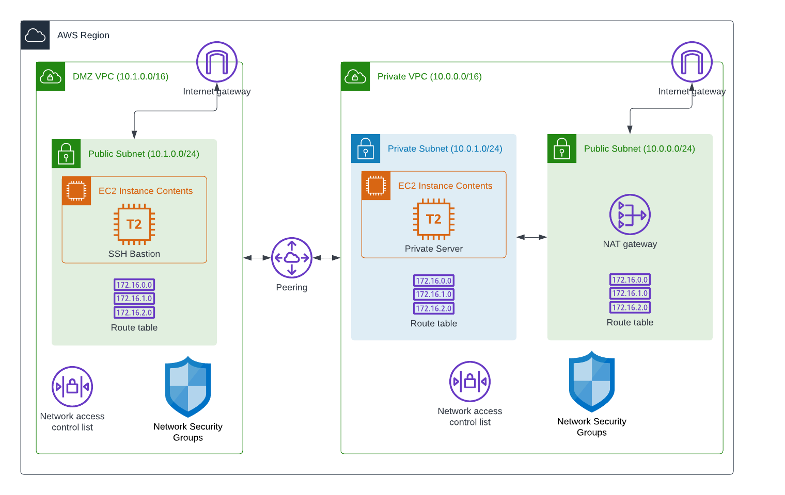

# demo.cloud.manage_direct_peered_networks

Create or delete a direct VPC peering model in AWS: a public-facing DMZ VPC (with a bastion host) peered to an entirely private VPC, connected with security groups and routing rules so the DMZ can reach hosts on the private network.

```yaml
- name: Create Peer Networking Model
  ansible.builtin.include_role:
    name: demo.cloud.manage_direct_peered_networks
  vars:
    manage_direct_peered_networks_operation: create
```

Once deployed, SSH to the bastion host in the DMZ to reach hosts on the private network. Set `manage_direct_peered_networks_operation` to `create` or `delete` before including the role -- that value selects which task file runs.

Repo playbooks: [`cloud/create_peer_network.yml`](../../../../../../cloud/create_peer_network.yml), [`cloud/delete_peer_network.yml`](../../../../../../cloud/delete_peer_network.yml).

## Requirements

- ansible-core >= 2.16.0
- Target: `localhost`
- `amazon.aws` collection (VPC, subnet, security group, and EC2 resources)
- AWS credentials with permission to create/delete VPCs, subnets, security groups, peering connections, route tables, and EC2 instances
- For `delete`: the same tags used at `create` time, so matching resources can be located and removed

## Role Variables

Defaults live in `defaults/main.yml`.

### Required (caller-supplied, no default)

```yaml
aws_region: us-east-1 # The region in which the resources are deployed
dmz_ssh_key_name: aws-test-key # The AWS SSH key to use when configuring access to the EC2 instances
```

### Optional

| Variable | Default | Description |
| --- | --- | --- |
| `tenancy` | `default` | EC2 tenancy for both VPCs' instances |
| `vpc_priv_net_cidr` | `10.0.0.0/16` | Private VPC CIDR |
| `vpc_priv_net_public_subnet_cidr` | `10.0.0.0/24` | Private VPC's public-facing subnet CIDR |
| `vpc_priv_net_priv_subnet_cidr` | `10.0.1.0/24` | Private VPC's private subnet CIDR |
| `vpc_priv_net_hosts_pattern` | `10.0.*` | Host pattern used by the caller's SSH config for the private network |
| `vpc_dmz_cidr` | `10.1.0.0/16` | DMZ VPC CIDR |
| `vpc_dmz_subnet1_cidr` | `10.1.0.0/24` | DMZ VPC subnet CIDR |
| `dmz_instance_type` | `t2.micro` | Instance type for the DMZ bastion |
| `dmz_instance_ami_owner` | `{{ omit }}` | AMI owner filter for the DMZ bastion |
| `dmz_instance_ami_architecture` | `x86_64` | AMI architecture filter for the DMZ bastion |
| `dmz_instance_ami_filter` | `RHEL-8*HVM-*Hourly*` | AMI name filter for the DMZ bastion |
| `dmz_instance_ami` | unset | Override to skip the AMI lookup entirely |
| `dmz_instance_name` | `dmz-ssh-tunnel-vm` | Name tag for the DMZ bastion |
| `priv_network_instance_type` | `t2.micro` | Instance type for the private-network VM |
| `priv_network_instance_ami_owner` | `{{ omit }}` | AMI owner filter for the private-network VM |
| `priv_network_instance_ami_architecture` | `x86_64` | AMI architecture filter for the private-network VM |
| `priv_network_instance_ami_filter` | `RHEL-8*HVM-*Hourly*` | AMI name filter for the private-network VM |
| `priv_network_instance_name` | `priv-network-vm` | Name tag for the private-network VM |
| `priv_natwork_instance_ami` | unset | Override to skip the AMI lookup entirely (note: variable name as shipped) |

## Infrastructure

The following AWS infrastructure resources are created during `create` and removed during `delete`. Each resource is tagged so the role can determine whether resources already exist, and which resources to clean up.

### Architecture Diagram



## Entry points

The role always runs `tasks/main.yml`, which validates `manage_direct_peered_networks_operation` and includes one of the files below:

| Entry point | Description |
| --- | --- |
| `create` | Create both VPCs, subnets, security groups, peering connection, routing, and the DMZ/private-network EC2 instances. |
| `delete` | Tear down the peering connection, EC2 instances, security groups, subnets, and VPCs created by `create`. |

## License

GPL-3.0-or-later

## Authors and Acknowledgments

- Ansible Product Demos -- maintained as part of [`demo.cloud`](../../README.md) for the AWS network peering demos in this repository.
