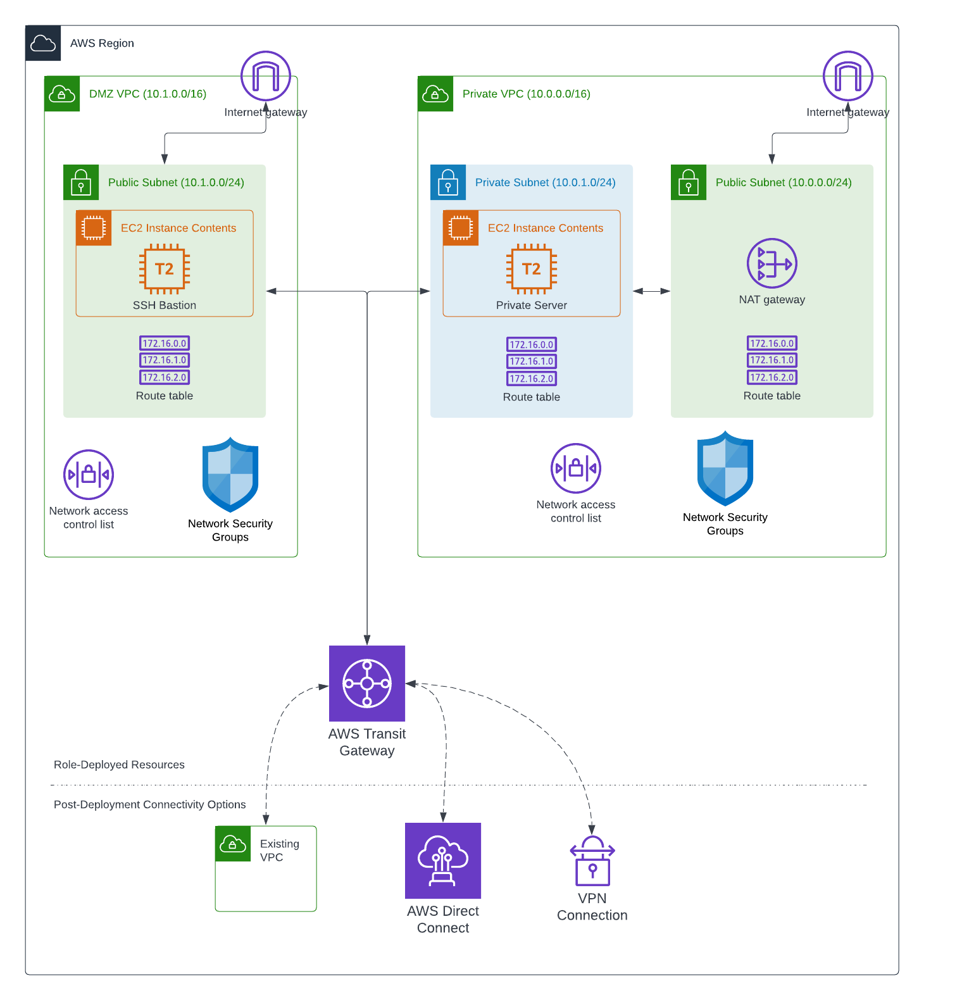

# demo.cloud.manage_transit_peered_networks

Create or delete a hub-and-spoke transit gateway VPC network model in AWS: a public-facing DMZ VPC (with a bastion host) and a private VPC, both attached to a transit gateway, with security groups and routing rules allowing traffic between them through the gateway.

```yaml
- name: Create Transit Networking Model
  ansible.builtin.include_role:
    name: demo.cloud.manage_transit_peered_networks
  vars:
    manage_transit_peered_networks_operation: create
```

Once deployed, SSH to the bastion host in the DMZ to reach hosts on the private network. Set `manage_transit_peered_networks_operation` to `create` or `delete` before including the role -- that value selects which task file runs. Resources below the transit gateway attachment (in the architecture diagram) demonstrate how additional VPCs could be connected the same way.

Repo playbooks: [`cloud/create_transit_network.yml`](../../../../../../cloud/create_transit_network.yml), [`cloud/delete_transit_network.yml`](../../../../../../cloud/delete_transit_network.yml).

## Requirements

- ansible-core >= 2.16.0
- Target: `localhost`
- `amazon.aws` collection (VPC, subnet, security group, transit gateway, and EC2 resources)
- AWS credentials with permission to create/delete VPCs, subnets, security groups, transit gateways/attachments, route tables, and EC2 instances
- For `delete`: the same tags used at `create` time, so matching resources can be located and removed

## Role Variables

Defaults live in `defaults/main.yml`.

### Required (caller-supplied, no default)

```yaml
aws_region: us-east-1 # The region in which the resources are deployed
dmz_ssh_key_name: aws-test-key # The AWS SSH key to use when configuring access to the EC2 instances on the DMZ network
priv_network_ssh_key_name: aws-test-key # The AWS SSH key to use when configuring access to the EC2 instances on the private network
ssh_key_data: "{{ lookup('file', '~/.ssh/aws-test-key.pem') }}" # The contents of the AWS SSH private key to store on the DMZ server for access to private network servers
```

### Optional

| Variable | Default | Description |
| --- | --- | --- |
| `tenancy` | `default` | EC2 tenancy for both VPCs' instances |
| `vpc_priv_net_cidr` | `10.0.0.0/16` | Private VPC CIDR |
| `vpc_priv_net_public_subnet_cidr` | `10.0.0.0/24` | Private VPC's public-facing subnet CIDR |
| `vpc_priv_net_priv_subnet_cidr` | `10.0.1.0/24` | Private VPC's private subnet CIDR |
| `vpc_priv_net_hosts_pattern` | `10.0.*` | Host pattern used by the caller's SSH config for the private network |
| `vpc_dmz_cidr` | `10.1.0.0/16` | DMZ VPC CIDR |
| `vpc_dmz_subnet1_cidr` | `10.1.0.0/24` | DMZ VPC subnet CIDR |
| `dmz_instance_type` | `t2.micro` | Instance type for the DMZ bastion |
| `dmz_instance_name` | `dmz-ssh-tunnel-vm` | Name tag for the DMZ bastion |
| `dmz_instance_ami_owner` | `{{ omit }}` | AMI owner filter for the DMZ bastion |
| `dmz_instance_ami_architecture` | `x86_64` | AMI architecture filter for the DMZ bastion |
| `dmz_instance_ami_filter` | `RHEL-8*HVM-*Hourly*` | AMI name filter for the DMZ bastion |
| `dmz_instance_ami` | unset | Override to skip the AMI lookup entirely |
| `priv_network_instance_type` | `t2.micro` | Instance type for the private-network VM |
| `priv_network_instance_name` | `priv-network-vm` | Name tag for the private-network VM |
| `priv_network_instance_ami_owner` | `{{ omit }}` | AMI owner filter for the private-network VM |
| `priv_network_instance_ami_architecture` | `x86_64` | AMI architecture filter for the private-network VM |
| `priv_network_instance_ami_filter` | `RHEL-8*HVM-*Hourly*` | AMI name filter for the private-network VM |
| `priv_natwork_instance_ami` | unset | Override to skip the AMI lookup entirely (note: variable name as shipped) |
| `transit_gateway_asn` | `64514` | ASN assigned to the transit gateway |
| `transit_gateway_auto_associate` | `true` | Whether attachments auto-associate with the default route table |
| `transit_gateway_auto_propagate` | `true` | Whether attachments auto-propagate routes to the default route table |
| `transit_gateway_dns_support` | `true` | Whether DNS support is enabled on the transit gateway |
| `ansible_ssh_private_key_file_local_path` | `~/.ssh/aws-test-key.pem` | Local path to the SSH private key (must exist locally or be mapped in an EE) |
| `ansible_ssh_private_key_file_dest_path` | `~/.ssh/aws-test-key.pem` | Path on the DMZ bastion where the private key is written for reaching the private network |
| `priv_network_ssh_user` | `ec2-user` | SSH user on the private-network VM |

## Infrastructure

The following AWS infrastructure resources are created during `create` and removed during `delete`. Each resource is tagged so the role can determine whether resources already exist, and which resources to clean up.

### Architecture Diagram



Resources below the dotted line demonstrate how you may connect other resources to the VPCs through a transit gateway attachment.

## Entry points

The role always runs `tasks/main.yml`, which validates `manage_transit_peered_networks_operation` and includes one of the files below:

| Entry point | Description |
| --- | --- |
| `create` | Create both VPCs, subnets, security groups, transit gateway and attachments, routing, and the DMZ/private-network EC2 instances. |
| `delete` | Tear down the transit gateway attachments/gateway, EC2 instances, security groups, subnets, and VPCs created by `create`. |

## License

GPL-3.0-or-later

## Authors and Acknowledgments

- Ansible Product Demos -- maintained as part of [`demo.cloud`](../../README.md) for the AWS transit networking demos in this repository.
