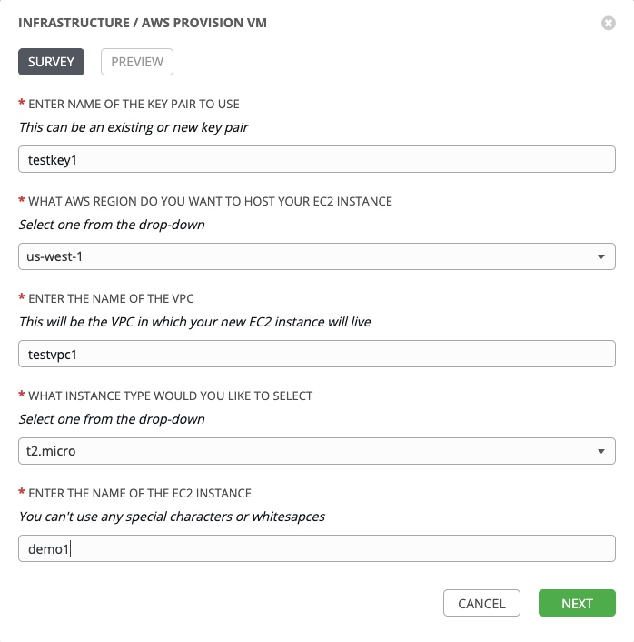
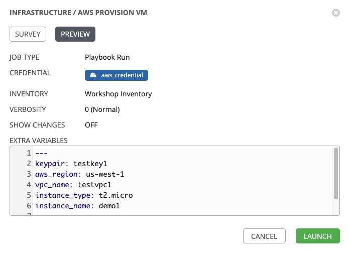
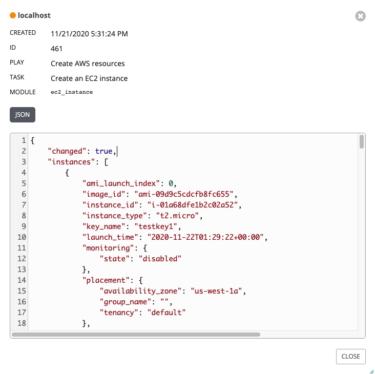
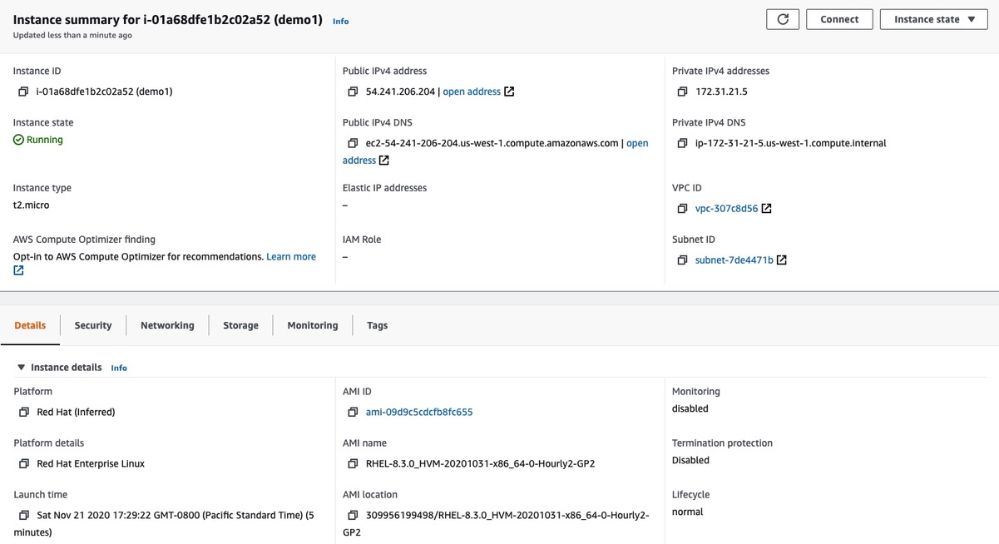

# Demo: AMS Provision VM

[Click here to return to master demo list](../../README.md#demo-repository)

## Table of Contents

* [Objective](#objective)
* [What business problem is solved?](#what-business-problem-is-solved)
* [Features show cased](#features-show-cased)
* [Video](#video)
* [Guide](#guide)

# Objective

Demostrate how anisble can be used to provision a RHEL VM in AWS

# What business problem is solved?

- **speed to market**:
reducing human time to provision VMs
- **reduce human error**:
standardize and automation a complex set of steps to reduce human errors
- **reduce complexity**:
does not require a System Administrator familiar with any cloud provider or its interface in order to provision any resources
  

# Features show cased

- Push button cloud provisioning 
- Self Service IT - Surveys

For description of these and other features of the Red Hat Ansible Automation Platform please refer to the [features README](../features.md)

# Video

Coming Soon

# Installing Demo

1. You will need to create programmatic access keys by following these [AWS Docs instructions](https://docs.aws.amazon.com/general/latest/gr/aws-sec-cred-types.html) See the section called "Programmatic access"

2. Then set the aws_demo variable to True. As well as provide the folowing variable values before loading this demo as shown below.
 - aws_demo: True
 - my_access_key:
 - my_secret_key: 

 See sample file named choose_demo_example_aws.yml

# Guide

1. Login to Ansible Platform UX

2. Navigate to **Templates**

     

3. Click the rocket next to **INFRASTRUCTURE / AWS Provision VM** to launch the Job

     

4.  The survey will prompt you to define the key pair, AWS region, VPC, Instance Type, and name of the new VM.

     

5. Enter values and press **NEXT**      

     

     Explain to audience what is happening here depending on audience persona

    **Persona A**: Technical audience that has written Ansible Playbooks before:
    Ansible can be used for more than on prem infrustructure it can also be used to provision many resource on the public clouds. Surveys create variables that the Job can use within Ansible Playbooks. This gives you the ability to create one playbook that can be used for reoccuring RHEL provisioning in various AWS regions instead of a job template for each region or VM provisioned.  Again saving you time and effort to write seperate playbooks for each use case.  In the screenshot you will see the variables are named **resource_group**, **location**, and **vm_name** with the values of testdemorg7, eastus, and test-server07.

    **Persona B**: Decision maker audience, IT manager or above:
    reiterate business values above.  This allows a non AWS Cloud expert the ability to automate routine tasks within a cloud environment.  They can't provision servers that are not vetted and put within the job template or to locations that are not preapproved within the Survey. Freeing them from the mundance and repeative task of VM provisioning while maintaining the highest level of security and compliance across your organization. In the event that your IT process does not allow the Red Hat Ansible Automation Platform to be the front end, it has a rich and powerful API that can work with existing workflows such as ServiceNow.

6. Execute the job by pressing the green **LAUNCH** button

7. Explain what is happening:

     - Job has started executed in the background.  The user can navigate off this page and the job will continue to execute.
     - On the left is the **Job Details Pane** labeled simply with **DETAILS**.  This information is logged and tells you who, what, when and how.
       - **who** - who launched the job, in this example is the admin user
       - **what** - the project and Ansible Playbook used, and which credential to login to the infrastructure
       - **when** - time stamps for start, end and duration of the job run.
       - **how** - the job status (pass, fail), enviornment and execution node
     - The larger window on the right is the **Standard Out Pane**.  This provides the same console output the user would be used to on the command-line for troubleshooting purposes.  Some important takeways to showcase are:
       - aggregate info is at the top including the amount of Plays, tasks, hosts and time duration.
       - this pane can be expanded to take up entire browser window
       - Ansible Playbook can be downloaded for troubleshooting purposes
       - **click on task output** to show them task-by-task JSON output that can be used for troubleshooting or just getting additional information
       

8. Circle back and summarize

     You need to circle back what has been showcased to the [business reasons listed above](#what-business-problem-is-solved).  You are welcome to verify on AWS Console that the RHEL server was actually provisioned but unless you have a very technical audience you are going to start losing folks.  The real business solution here is automating away the mundane and repetative. 

9. Verify RHEL VM is up (Optional) 

      qwer
      

---
You have finished this demo.  [Click here to return to master demo list](../../README.md#demo-repository)
