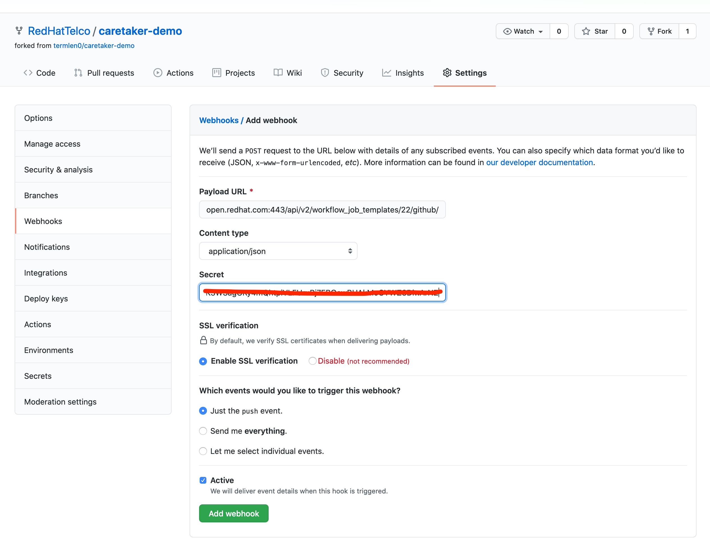
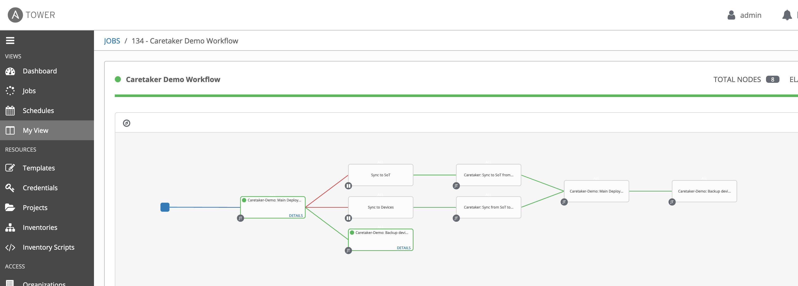

# Demo: Caretaker - Managing Out of Band changes for network devices

[Click here to return to master demo list](../../README.md#demo-repository)

## Table of Contents

* [Objective](#objective)
* [What business problem is solved?](#what-business-problem-is-solved)
* [Features show cased](#features-show-cased)
* [Video](#video)
* [Guide](#guide)

# Objective

This post introduces the idea of a “CareTaker” that detects out-of-band (OOB) changes made to the network endpoints and alerts the operator to make a manual decision.

# What business problem is solved?

- **Address operational impact of OOB changes**:
For organizations that have embraced GitOps, a big challenge that remains is the handling of OOB changes.

# Features show cased

- Ansible collections
- Workflows
- Approval Nodes
- Infrastructure as Code

[This blog post](https://termlen0.github.io/2020/11/28/observations/)  has all the background details for this demo:

# Video

https://youtu.be/wiUFKtR91Rw


# Demo initiation guide

1. One of the first things you will need is to add the git deploy private key. Navigate to *Credentials* and click on *Caretaker-Demo: credential*

2. Upload the private key found [here](https://drive.google.com/file/d/1m8Qorgre4XEgqG8C0ykB2Vd71-bJ7Mle/view?usp=sharing)

> NOTE: This private key allows the job template to push device configs to https://github.com/RedHatTelco/caretaker-sot

3. To test the key, go to *Templates* and launch *Caretaker-Demo: Backup device configs*. This should complete successfully.

> NOTE: This will also set the stage. At this point the running configs on the devices are in sync with the SoT

4. Fork https://github.com/redhattelco/caretaker-demo. This repo is contains the IaC pieces within the `host_vars` folder. You will also need your own fork so that you can update the Tower workflow template with a webhook that points to your fork of the repo.

> NOTE: The idea here is that when you update the IaC (add a bgp route prefix to advertise), that will kick off the Tower workflow to try and deploy the change.

# Guide

1. Navigate to the *Caretaker Demo Workflow* workflow template

2. Copy the webhook URL and add this to your fork of the caretaker-demo repo 

3. First demonstrate normal operations by simply adding a prefix to advertise within */host_vars/rtr1/bgp.yml* or */host_vars/rtr2/bgp.yml*

4. This kicks off the caretaker workflow. But since the devices are in sync with the SoT, this deploys fine and back ups the updated configs into the SoT. 

5. Next make a manual change to the network device. For example:

``` bash
on rtr2
=======
rtr2#conf t
rtr2(config)#int loopback 0
rtr2(config-if-Lo0)#description "Adding a trivial demo OOB change"
rtr2(config-if-Lo0)#exit
rtr2(config)#exit
rtr2#wr mem
Copy completed successfully.
```
6. Now go back to the SoT and either add or remove a prefix.


8. Circle back and summarize

     You need to circle back what has been showcased to the [business reasons listed above](#what-business-problem-is-solved).


---
You have finished this demo.  [Click here to return to master demo list](../../README.md#demo-repository)
