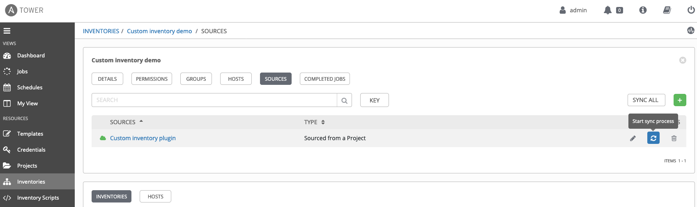

# Demo: Azure MySQL Server

[Click here to return to master demo list](../../README.md#demo-repository)

## Table of Contents

* [Objective](#objective)
* [What business problem is solved?](#what-business-problem-is-solved)
* [Features show cased](#features-show-cased)
* [Video](#video)
* [Guide](#guide)

# Objective

Showcase a practical implementation of Ansible's [custom inventory plugin capability.](https://docs.ansible.com/ansible/latest/plugins/inventory.html)

# What business problem is solved?

- **Leverage existing tool investments**:
No matter what tools the customer has, it is very easy to build ansible inventory plugins to take advantage of them.

# Features show cased

- Ansible custom inventory plugin

[This blog post](https://termlen0.github.io/2019/11/16/observations/)  has all the background details for this demo:

# Video

Coming Soon

# Guide

Show the customer the [CSV file](https://github.com/termlen0/custom-inventory-plugin/blob/master/csv_inventory/myinventory.csv) that will be the source for the dynamic inventory.

1. Login to Ansible Platform UX

2. Navigate to **Inventories**

     

3. Click the **Custom inventory demo** inventory and navigate to sources

     

4. Click on the **Refresh/Sync** icon to start the sync process

     

5. Navigate to **HOSTS** and **GROUPS** to showcase how the hosts and groups were populated from a spreadsheet

     

     Explain to audience what is happening here depending on audience persona

    **Persona A**: Technical audience that has written Ansible Playbooks before:
   Ansible custom inventory plugins are easy to build and can work with multiple backend systems

    **Persona B**: Decision maker audience, IT manager or above:
    Reiterate business values above. Highlight that one of the keys
    that makes the Ansible Automation Platform successful is the
    layered approach that the platform takes vs trying to provide a
    turn-key solution that expects greenfield deployment.

8. Circle back and summarize

     You need to circle back what has been showcased to the [business reasons listed above](#what-business-problem-is-solved).

---
You have finished this demo.  [Click here to return to master demo list](../../README.md#demo-repository)
