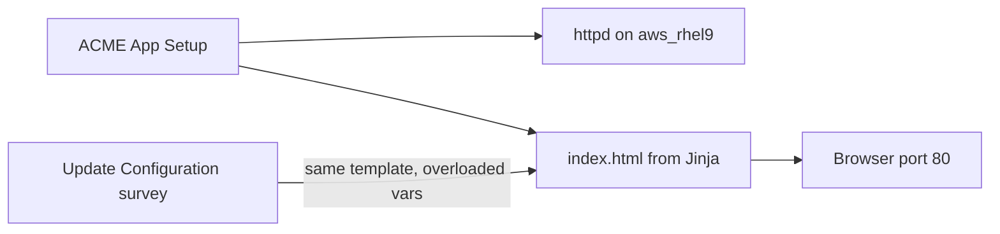

# Infrastructure | Simple Config Drift

Ansible owns one HTML file. **Infrastructure ǀ ACME App - Setup** installs a tiny ACME storefront on `aws_rhel9` and writes the approved baseline. **Infrastructure ǀ ACME App - Update Configuration** re-renders the same Jinja2 template with survey knobs so the live page changes. Re-run Setup to restore the baseline. No Kafka, EDA, or auditd — this is the teaching step before [Event-Driven Config Drift Remediation](config-drift.md).

## Prerequisites

- **Deploy Cloud Stack in AWS** so `aws_rhel9` is in inventory
- **APD ǀ Single demo setup** — category `infrastructure`
- **LINUX ǀ Register RHEL with RHSM** — `dnf` needs a subscription to install httpd
- SSH access via **APD Machine Credential**

## Survey prompts

### Infrastructure ǀ ACME App - Setup

| Prompt | Variable | Type | Default |
|--------|----------|------|---------|
| Server Name or Pattern | `_hosts` | text | `aws_rhel9` |

Baseline storefront vars are pinned on the job template as extra vars (company, theme, product, price, and so on). Click Launch.

### Infrastructure ǀ ACME App - Update Configuration

| Prompt | Variable | Type | Default |
|--------|----------|------|---------|
| Server Name or Pattern | `_hosts` | text | `aws_rhel9` |
| Company name | `acme_app_company` | text | ACME Corp |
| Tagline | `acme_app_tagline` | text | Widgets you can trust |
| Environment | `acme_app_environment` | multiplechoice | Production |
| Theme | `acme_app_theme` | multiplechoice | redhat |
| Promo banner | `acme_app_banner` | textarea | Welcome to the ACME storefront |
| Featured product | `acme_app_product` | text | Super Widget |
| Price | `acme_app_price` | text | $19.99 |
| Product blurb | `acme_app_product_blurb` | textarea | Our flagship widget. Built to last. |
| SKU | `acme_app_sku` | text | ACME-1001 |
| Footer | `acme_app_footer` | text | Managed by Ansible Automation Platform |

Environment choices: Production, Staging, Development. Theme choices: redhat, navy, forest. Both change CSS classes on the page.

## Job templates

| Template | Playbook | Description |
|----------|----------|-------------|
| Infrastructure ǀ ACME App - Setup | [`infrastructure/acme-app/playbooks/setup.yml`](../acme-app/playbooks/setup.yml) | Installs httpd, copies CSS, renders the approved baseline |
| Infrastructure ǀ ACME App - Update Configuration | [`infrastructure/acme-app/playbooks/configure.yml`](../acme-app/playbooks/configure.yml) | Re-renders [`index.html.j2`](../acme-app/playbooks/templates/index.html.j2) with survey vars |

## Why it matters

- Desired state is a template plus variables — the same pattern as production config files
- Changing the survey is a controlled drift of the approved baseline; re-running Setup restores it
- The HTML is deliberately tiny so the conversation stays on Ansible, not on the app

## Presenter walkthrough

1. Launch **Infrastructure ǀ ACME App - Setup** with the default host `aws_rhel9`.
2. Open the URL from the job output (`http://<aws_rhel9 public IP>/`) — ACME Corp, Production, Super Widget at $19.99.
3. Launch **Infrastructure ǀ ACME App - Update Configuration**. Change environment to Staging, theme to navy, and the product name or price.
4. Refresh the browser — same template, new values.
5. Re-run **Infrastructure ǀ ACME App - Setup** — the approved baseline is back.

## Talking points

- One Jinja template, two job templates: install once, then manage the file
- CSS holds the look; the playbook only interpolates vars
- Next step for a production-shaped pipeline: [Event-Driven Config Drift Remediation](config-drift.md) (auditd → Filebeat → Kafka → EDA → AAP)

## Related demos

| Demo | Description |
|------|-------------|
| [Config Drift Remediation](./config-drift.md) | Event-driven sshd_config detection and auto-remediation |
| [Podman Webserver](../../linux/docs/linux-podman-webserver.md) | Containerized httpd with a survey-driven home page |
