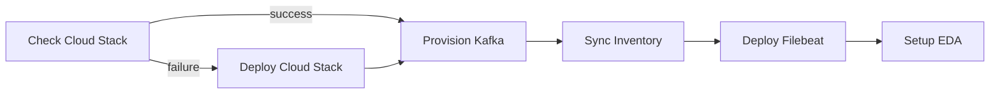

# Event-Driven Configuration Drift Remediation

Production-style demo: a Linux administrator changes a protected configuration file, Linux auditing detects the change, Filebeat ships the event to Kafka, Event-Driven Ansible evaluates the signal, and AAP restores the approved configuration.

```text
configuration change
  → Linux audit event (auditd)
  → Filebeat
  → Kafka
  → Event-Driven Ansible
  → AAP remediation
```

## Presenter guide

Two parts: **one-time setup**, then **show the demo**.

### Part 1 — One-time setup

1. Sync the **Ansible Product Demos** project from your fork branch.
2. Run **APD | Single demo setup** with category `infrastructure` (cloud stack must already exist, or the workflow deploys it for you).
3. Launch **Infrastructure | Config Drift - Full Setup** and complete the survey (region, owner, environment).

That single workflow:

- Checks whether `aws_rhel8` and `aws_rhel9` are in inventory — if not, runs **Deploy Cloud Stack in AWS** automatically
- Provisions the Kafka queue (`aws_kafka`)
- Syncs AWS inventory
- Deploys auditd + Filebeat on `aws_rhel*` with Kafka output
- Activates the EDA rulebook (`config_drift_kafka`)

When it finishes, the demo is ready to go.

### Part 2 — Show the demo

**Option A — drift from AAP (recommended for presenters):**

1. Run **LINUX | Config Drift - Introduce SSHD Drift** (default limit `aws_rhel*` hits both RHEL workers).
2. Watch **Automation Decisions** — activation `config_drift_kafka` consumes the event.
3. Watch **Automation Execution** — **LINUX | SSHD Configuration Remediation** launches (once per host, throttled to every 15 seconds).
4. Confirm on the workers: `sudo grep -i Root /etc/ssh/sshd_config` → `PermitRootLogin no`.

**Option B — drift manually on a host:**

```bash
sudo sed -i 's/^#\?PermitRootLogin.*/PermitRootLogin yes/' /etc/ssh/sshd_config
sudo grep -i Root /etc/ssh/sshd_config
```

Same EDA → remediation flow follows within ~15 seconds.

### What to say

- **Detection is broad** — any write to `/etc/ssh/sshd_config` triggers the pipeline (audit key `sshd_config_change`).
- **Remediation is narrow (on purpose)** — the playbook only restores `PermitRootLogin no`. Swap the audit watch, rulebook filter, and remediation playbook to protect any file you want.
- **No polling** — the OS emits an event; EDA reacts in near real time.

## Prerequisites

- **Deploy Cloud Stack in AWS** already run, *or* let the Full Setup workflow deploy it for you
- **APD | Single demo setup** — category `infrastructure`
- **RHSM Registration** credential — org ID and activation key (see **LINUX | Register RHEL with RHSM**)
- **Automation Decisions (EDA)** on AAP
- SSH access via **APD Machine Credential**

### One-shot setup (recommended)

Launch **Infrastructure | Config Drift - Full Setup** — a single workflow that:

1. Verifies `aws_rhel8` and `aws_rhel9` are in inventory (or runs **Deploy Cloud Stack in AWS** if missing)
2. Provisions Kafka (`aws_kafka`)
3. Syncs AWS inventory
4. Deploys auditd + Filebeat with Kafka output on `aws_rhel*`
5. Activates the EDA rulebook



In the AAP workflow visualizer, the main path runs left to right. **Deploy Cloud Stack** appears on the failure branch below **Check Cloud Stack** when workers are missing.

Survey prompts: AWS region, owner tag, and environment (same as cloud stack deploy).

For the live demo moment, run **LINUX | Config Drift - Introduce SSHD Drift** separately — it is not part of this workflow.

### Manual setup (step by step)

If you prefer individual jobs:

1. **Deploy Cloud Stack in AWS** — `aws_rhel8`, `aws_rhel9` in inventory
2. **LINUX | Register RHEL with RHSM** — default `_hosts`: `aws_rhel*`
3. **Infrastructure | AWS - Provision Kafka Queue**
4. Sync **AWS Inventory**
5. **LINUX | Config Drift - Deploy Audit and Filebeat** — Filebeat output: `kafka`
6. **Infrastructure | Setup Rulebook for Kafka Queue - Config Drift & Remediation**

### Host targeting

| Pattern | Hosts matched | Use when |
|---------|---------------|----------|
| `aws_rhel9` | One RHEL 9 worker | Quick single-host demo |
| `aws_rhel*` | `aws_rhel8` + `aws_rhel9` | Filebeat/auditd on every RHEL **worker** VM |
| `reports` | Report server only | Not a config-drift target — different role in the stack |

`aws_rhel*` does **not** match `reports`. If your job run includes `reports`, you used a broader limit than `aws_rhel*` (for example a group or `*`).

Unreachable hosts are skipped (`ignore_unreachable`) so one bad SSH target does not block the rest of the fleet.

## Job templates

| Template | Playbook | Stage |
|----------|----------|-------|
| **Infrastructure ǀ Config Drift - Full Setup** | workflow | 1–4 (one-shot) |
| Infrastructure ǀ Config Drift - Check Cloud Stack | [`infrastructure/config-drift/playbooks/check_cloud_stack.yml`](../config-drift/playbooks/check_cloud_stack.yml) | workflow preflight |
| LINUX ǀ Config Drift - Deploy Audit and Filebeat | [`infrastructure/config-drift/playbooks/deploy_audit_filebeat.yml`](../config-drift/playbooks/deploy_audit_filebeat.yml) | 1–2, 3 (kafka output) |
| LINUX ǀ Config Drift - Introduce SSHD Drift | [`infrastructure/config-drift/playbooks/drift_sshd.yml`](../config-drift/playbooks/drift_sshd.yml) | demo (live drift) |
| Infrastructure ǀ AWS - Provision Kafka Queue | [`infrastructure/config-drift/playbooks/provision_kafka.yml`](../config-drift/playbooks/provision_kafka.yml) | 3 |
| Infrastructure ǀ Setup Rulebook for Kafka Queue - Config Drift & Remediation | [`infrastructure/config-drift/playbooks/setup_eda_activation.yml`](../config-drift/playbooks/setup_eda_activation.yml) | 4 |
| LINUX ǀ SSHD Configuration Remediation | [`infrastructure/config-drift/playbooks/remediate_sshd.yml`](../config-drift/playbooks/remediate_sshd.yml) | 4–5 (EDA-launched) |

## Build status

| Stage | Component | Status |
|-------|-----------|--------|
| 1 | auditd persistent watch on `/etc/ssh/sshd_config` | **Implemented** |
| 2 | Filebeat auditd module (console or Kafka output) | **Implemented** |
| 3 | Kafka on dedicated AWS EC2 (Podman KRaft) | **Implemented** — [walkthrough](config-drift-kafka.md) |
| 4 | EDA rulebook + activation | **Implemented** — [walkthrough](config-drift-eda.md) |
| 5 | AAP sshd remediation playbook | **Implemented** (basic PermitRootLogin restore) |

---

## Stage 1 — auditd

### Setup

1. Run **APD | Single demo setup** with `infrastructure`.
2. Run **Infrastructure | Config Drift - Full Setup**, or deploy auditd manually with **LINUX | Config Drift - Deploy Audit and Filebeat** — default `_hosts`: `aws_rhel*`.

### What was deployed

Persistent rule in `/etc/audit/rules.d/99-sshd-config.rules`:

```text
-w /etc/ssh/sshd_config -p wa -k sshd_config_change
```

| Flag | Meaning |
|------|---------|
| `-w` | Watch this path |
| `-p wa` | Writes and attribute changes |
| `-k sshd_config_change` | Searchable audit key |

### Verify rule is loaded

```bash
sudo auditctl -l | grep sshd_config
```

### Trigger a test change

```bash
sudo cp -a /etc/ssh/sshd_config /tmp/sshd_config.bak
sudo sed -i 's/^#\?PermitRootLogin.*/PermitRootLogin yes/' /etc/ssh/sshd_config
grep PermitRootLogin /etc/ssh/sshd_config
```

### Inspect audit events

```bash
sudo ausearch -k sshd_config_change -ts recent
```

### Understanding the audit records

One file edit typically produces **multiple correlated records**:

| Record type | What it tells you |
|-------------|-------------------|
| `type=SYSCALL` | Syscall that performed the write |
| `type=PATH` | File path — look for `name="/etc/ssh/sshd_config"` |
| `type=PROCTITLE` | Command line (e.g. `sed`, `vi`) |
| `key=sshd_config_change` | Matches our `-k` tag |
| `uid` / `auid` | Effective user / login UID |
| `comm` / `exe` | Process name and executable path |

### Restore after testing

```bash
sudo cp -a /tmp/sshd_config.bak /etc/ssh/sshd_config
```

---

## Stage 2 — Filebeat

Filebeat is installed and configured automatically by the same job template.

- Elastic 8.x `filebeat` package with the **auditd** module
- Reads `/var/log/audit/audit.log*`
- **Console output** (pretty JSON) for validation before Kafka is wired in Stage 3

### Verify Filebeat is running

```bash
sudo systemctl status filebeat
sudo journalctl -u filebeat -f
```

### Trigger a test change and watch events

```bash
sudo sed -i 's/^#\?PermitRootLogin.*/PermitRootLogin yes/' /etc/ssh/sshd_config
```

In another session on the host:

```bash
sudo journalctl -u filebeat -f
```

You should see parsed JSON with audit fields, hostname, and `@timestamp`.

Foreground debug:

```bash
sudo systemctl stop filebeat
sudo filebeat -e -c /etc/filebeat/filebeat.yml
```

## Stage 3 — Kafka

Full step-by-step walkthrough: **[Config Drift — Kafka Queue](config-drift-kafka.md)** (provision broker, wire Filebeat, consume and validate `sshd_config_change` events).

### Quick reference

1. Run **Infrastructure | AWS - Provision Kafka Queue** (same region/owner as cloud stack).
2. Sync **AWS Inventory** so `aws_kafka` appears.
3. Re-run **LINUX | Config Drift - Deploy Audit and Filebeat** with **Filebeat output**: `kafka`.
4. On `aws_kafka`, consume topic `linux-audit-events` and filter for `sshd_config_change` (see kafka walkthrough for `9094` admin listener).

## Stage 4 — Event-Driven Ansible

Full walkthrough: **[Config Drift — EDA](config-drift-eda.md)**.

If you used **Infrastructure | Config Drift - Full Setup**, EDA activation is already configured. Otherwise:

1. Sync the **Ansible Product Demos** EDA project.
2. Run **Infrastructure | Setup Rulebook for Kafka Queue - Config Drift & Remediation**.
3. Confirm activation **config_drift_kafka** is running.
4. Run **LINUX | Config Drift - Introduce SSHD Drift** or edit `sshd_config` on a worker — **LINUX | SSHD Configuration Remediation** should launch automatically.

## Stage 5 — AAP remediation

**LINUX | SSHD Configuration Remediation** restores `PermitRootLogin no`, validates with `sshd -t`, and reloads `sshd`. It resolves the target host from `config_drift_target_ip` (private IP passed by the EDA rulebook).

## Why it matters

- Demonstrates a credible production pattern: audit at the OS, ship via a log agent, route through Kafka, decide in EDA, remediate in AAP
- Ansible is not polling for drift — infrastructure emits a signal when configuration changes
- Maps to enterprise deployments where Kafka may be replaced by a SIEM or cloud event bus
