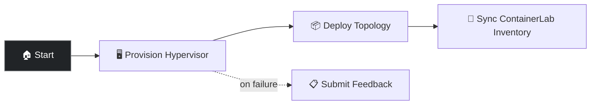

# Deploy Containerlab Stack

Provisions a self-contained Cisco lab on AWS: nested-virt EC2 hypervisor, containerlab topology (n9kv + cat8kv), and ContainerLab Inventory sync. This is the starting point for the network Configure, Report, Backup, and DISA STIG demos.

## Prerequisites

- **If using RHDP (demo.redhat.com):** Run **APD ǀ Multi-demo setup** (or **APD ǀ Single demo setup** and choose `network`). AWS and AAP credentials are pre-configured for you.
- **If using your own installation:** Run **APD ǀ Single demo setup** and choose `network`. Configure the **AWS** credential with your Access Key and Secret Key.

## Survey prompts

| Prompt | Variable | Type | Required |
|--------|----------|------|----------|
| AWS Region | `clab_aws_region` | multiplechoice | Yes |
| Instance Type | `clab_aws_instance_type` | multiplechoice | Yes |
| Owner | `clab_aws_owner_tag` | text | Yes |

Options: region `us-east-2` / `us-west-2`; instance type `c8i.2xlarge` (default) / `c8i.4xlarge`.

## Workflow

1. **Provision Hypervisor** — Creates VPC, subnet, security group, keypair, and launches a RHEL 9 EC2 instance with nested virtualization
2. **Deploy Topology** — Installs podman and containerlab, pulls Cisco images, and starts n9kv (NX-OS) + cat8kv (IOS-XE)
3. **Sync ContainerLab Inventory** — Imports the hypervisor and sets device connection details for demo job templates
4. **Submit Feedback** — Opens only if hypervisor provisioning fails

Provisioning takes approximately 10–15 minutes while device images pull and virtual devices boot.

## Job templates

| Template | Playbook | Description |
|----------|----------|-------------|
| NETWORK ǀ Deploy Containerlab Stack | [`network/setup.yml`](../setup.yml) | Workflow that provisions hypervisor, deploys topology, and syncs inventory |
| NETWORK ǀ Containerlab ǀ Provision Hypervisor | [`network/provision_hypervisor.yml`](../provision_hypervisor.yml) | Creates AWS networking and the nested-virt EC2 hypervisor |
| NETWORK ǀ Containerlab ǀ Deploy Topology | [`network/deploy_containerlab.yml`](../deploy_containerlab.yml) | Installs containerlab and starts the n9kv + cat8kv topology |

## Why it matters

- Replaces external Cisco DevNet sandbox dependencies with a fully self-contained lab
- Nested virtualization on AWS lets you run real NX-OS and IOS-XE images under containerlab
- Dynamic inventory + SSH Proxy credentials give AAP a clean path to the lab devices
- One workflow brings up everything the day-2 network demos need

## Presenter walkthrough

1. **Show the survey:** Region, instance size, and owner tag — explain how surveys keep self-service provisioning safe.
2. **Launch:** Start **NETWORK ǀ Deploy Containerlab Stack**. Call out the three success path nodes: hypervisor → topology → inventory sync.
3. **While it runs:** Explain nested virt, containerlab, and the two platforms (NX-OS n9kv on port 2122, IOS-XE cat8kv on port 2123).
4. **Inventory sync:** After success, open **ContainerLab Inventory** and show the hypervisor/device hosts.
5. **Transition:** Run **NETWORK ǀ Containerlab ǀ Configure Devices**, then Report, Backup, or DISA STIG.

## Related demos

| Demo | Description |
|------|-------------|
| 💥 [Destroy Containerlab Stack](./network-destroy-containerlab-stack.md) | Tear down the lab when finished |
| 🌐 [Configure Devices](./network-configuration.md) | Apply baseline banner, NTP, and SNMP |
| 🌐 [Report](./network-report.md) | Gather facts from the lab devices |
| 🌐 [Backup](./network-backup.md) | Back up running configs |
| 🌐 [DISA STIG](./network-disa-stig.md) | Audit IOS-XE against DISA STIG |
