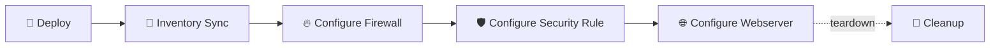

# Palo Alto Firewall Demo

A workflow that provisions a Palo Alto Networks virtual firewall in AWS, configures it using the paloaltonetworks.panos collection, deploys a webserver behind it, and sets up security rules to demonstrate firewall policy management. Covers the full lifecycle from infrastructure provisioning through configuration and validation.

## Workflow

1. **Deploy** — Provisions the PAN-OS virtual firewall, bastion host, and webserver in AWS
2. **Inventory Sync** — Discovers the new EC2 instances via dynamic inventory
3. **Configure Firewall** — Applies initial PAN-OS configuration using the certified panos collection
4. **Configure Security Rule** — Creates firewall security rules to allow traffic
5. **Configure Webserver** — Deploys a webserver behind the firewall for testing
6. **Cleanup** — Tears down all resources when the demo is complete

## Prerequisites

- AWS credential configured with Access and Secret key
- Subscribe to the **VM-Series Next-Gen Virtual Firewall** AMI in the AWS Marketplace (five-minute approval process)
- Run APD setup with the network category to create the required credentials and templates
- **Palo Alto Firewall Admin** credential (created by setup with placeholder values)
- **Palo Alto Bastion** credential (created by setup with placeholder values)

## Job templates

| Template | Playbook | Description |
|----------|----------|-------------|
| NETWORK ǀ Panos ǀ Deploy | [`network/panos/deploy.yml`](../panos/deploy.yml) | Provisions the virtual firewall, bastion host, and webserver instances in AWS |
| Panos Demo Instances (Inventory Sync) | `(inventory sync)` | Syncs the dynamic inventory source to discover the newly created EC2 instances |
| NETWORK ǀ Panos ǀ Configure Firewall | [`network/panos/configure_firewall.yml`](../panos/configure_firewall.yml) | Applies initial firewall configuration using the paloaltonetworks.panos collection |
| NETWORK ǀ Panos ǀ Configure Webserver | [`network/panos/configure_webserver.yml`](../panos/configure_webserver.yml) | Configures a basic Apache webserver behind the firewall to demonstrate security rules |

## Why it matters

- Network security is a top priority — this demo shows AAP managing next-gen firewalls through certified collections
- The paloaltonetworks.panos collection is API-driven, demonstrating agentless network automation
- Provisioning infrastructure and configuring security policies in one workflow shows end-to-end capability
- Live security rule toggling (allow/deny) provides a dramatic, visual demo moment
- Covers a real vendor product (Palo Alto), not just lab devices — credibility with network teams

## Presenter walkthrough

1. **Show the starting state:** Display the empty inventory and the placeholder credentials. 'Nothing exists yet — the workflow builds everything from scratch.'
2. **Launch the workflow:** Start the workflow and explain the node sequence: Deploy → (parallel) Inventory Sync and Configure Firewall → Configure Webserver.
3. **Fill the wait time:** The workflow takes roughly 25 minutes (mostly waiting for the virtual firewall to initialize). Use this time to walk through the architecture diagram and explain the three automation mechanisms: amazon.aws for provisioning, paloaltonetworks.panos for firewall config, and RHEL system roles for the webserver.
4. **Verify the deployment:** After completion, open the firewall management portal at the management IP (HTTPS). Log in with admin credentials. Open the webserver at the public IP (HTTP) to confirm traffic flows.
5. **Toggle a security rule:** Launch the **NETWORK | Panos | Configure Security Rule** job template. Accept the defaults to deny traffic. Refresh the webserver tab — it no longer loads.
6. **Show the firewall logs:** In the Palo Alto management portal, navigate to Monitor → Traffic logs. Show the denied traffic entries. 'The firewall is enforcing the rule we just pushed via Ansible.'

## Talking points

- This is a real Palo Alto Networks firewall, not a simulator. The paloaltonetworks.panos collection is a certified, vendor-supported Ansible collection.
- API-driven configuration means no SSH to the firewall — everything goes through the PAN-OS management API. This is how modern network automation works.
- The live deny-then-allow demo is a crowd pleaser. People can see the webserver go down and come back up in real time.
- Three different automation mechanisms in one workflow — cloud provisioning, firewall API, and SSH-based Linux config — all orchestrated by AAP.
- After the demo, the Cleanup job template tears down all AWS resources. No orphaned instances, no surprise bills.

## Related demos

| Demo | Description |
|------|-------------|
| 🌐 [Golden Configuration](./network-configuration.md) | Deploy golden configurations to Cisco IOS, IOSXR, and NXOS devices using resource modules |
| 🌐 [DISA STIG](./network-disa-stig.md) | Run network DISA STIG compliance checks to show security hardening for network devices |
| 🚀 [Deploy Cloud Stack in AWS](../../cloud/docs/deploy-cloud-stack.md) | Provision the full demo infrastructure including the reports server used by other network demos |
