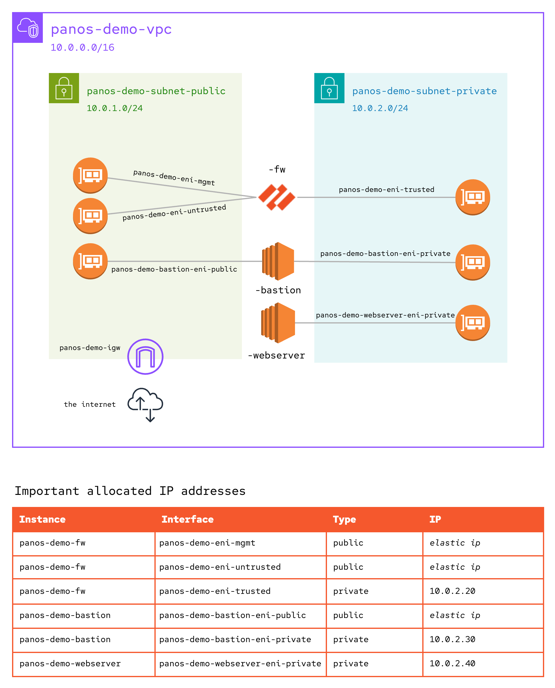

# Demo: Deploy a Palo Alto Firewall and Configure Security Rule(s)

This demo creates a (virtual) Palo Alto Firewall instance, a bastion host, and a webserver. The full demo covers provisioning, initial configuration, and security rule management using the [palotaltonetworks.panos](https://console.redhat.com/ansible/automation-hub/repo/published/paloaltonetworks/panos/) collection.

## Prerequisites

### AWS account prerequisites

Access to a current Palo Alto AMI from the AWS marketplace is required before the Infoblox instance can be created.

* Log in to the AWS console (RHDP users: link and credentials provided in catalog item output)
* Go to the AMI page for the [VM-Series Next-Gen Virtual Firewall w/Advanced Threat Prevention (PAYG)](https://aws.amazon.com/marketplace/pp?sku=e9yfvyj3uag5uo5j2hjikv74n) in the AWS Marketplace
* Select "Try for free"
* Review the terms (should be a $0.00 cost) and click "Subscribe".  The request needs to be processed and approved before the AMI will be available for use with this APD demo.
* The approval process takes around five minutes.  Once the request has been approved the page will refresh with a banner stating the AMI was successfully purchased.

If this step is skipped, the playbook which deploys the virtual firewall instance will fail.

### APD prerequisites

Run the "APD | single-demo setup" job template and choose the "network" category in order to create the required resources:

| Type | Name |
| --- | --- |
| Credential Type | SSH Proxy |
| Credential | Palo Alto Bastion |
| Credential Type | Palo Alto Networks Provider |
| Credential | Palo Alto Firewall Admin |
| Inventory Source | Panos Demo Instances |
| Job Template | NETWORK \| Panos \| Deploy |
| Job Template | NETWORK \| Panos \| Configure Firewall |
| Job Template | NETWORK \| Panos \| Configure Security Rule |
| Job Template | NETWORK \| Panos \| Configure Webserver |
| Job Template | NETWORK \| Panos \| Cleanup |
| Workflow Job Template | NETWORK \| Panos \| Demo Firewall Workflow |

Once provisioned, you can update the Palo Alto Bastion credential with your own private key. This will enable you to ssh to the ec2 instances with your public key. If you choose to bring-your-own keypair, then have the public key ready when you launch the workflow. The workflow will generate a keypair if not provided.

## Demo workflow job template

The "NETWORK | Panos | Demo Firewall Workflow" workflow automates the following actions:

_If you want to bring-your-own keypair, the update the Palo Alto Bastion credential before launching this workflow. Provide your public key to the workflow survey._

* Creates the infrastructure required to support the demo (see architecture diagram)
* Updates Credential details for downstream use (mgmt ip, bastion ip)
* Syncs the dynamic inventory source
* Configures the firewall using the paloaltonetworks.panos collection
* Configures a basic webserver to demonstrate security rule modifications
* Creates an EC2 instance named "apd-infoblox" and refreshes the AAP inventory.

## Giving the demo

1. In AAP, display the "NETWORK | Panos | Demo Firewall Workflow" workflow job template and walk through the individual steps.  Click on the "Infrastructure -> Credentials" tab and display the "Palo Alto Bastion" and "Palo Alto Network Admin" credentials, noting that they have a placeholder values for the host details.  Click on the "Infrastructure -> Hosts" tab to show that the Demo instances do not yet exist.

2. **OPTIONAL**: Update the "Palo Alto Bastion" Credential with your own private key.

3. Run the "NETWORK | Panos | Demo Firewall Workflow" workflow job template.  Explain that the survey answers will be used by the AWS-related steps in the workflow. If a private key was configured, then provide the associated public key. Otherwise, leave the survey blank and explain how the automation will generate a key-pair for the demo.

4. The workflow takes roughly 25 minutes to complete, the majority of that time is waiting for the virtual firewall instance to stand up and be in a ready state. During this time frame, I recommend reviewing the architecture diagram and explaining the mechanisms used to complete the deployment:
   - Provisioning AWS resources with the amazon.aws collection (API-driven)
   - Configuring the firewall with the paloaltonetworks.panos collection (API-driven)
   - Configuring a webserver with the network RHEL system role (direct via ssh proxy)

5. Once the workflow is complete, navigate to the Job representing the final node in the workflow, "NETWORK | Panos | Configure Webserver". On the details tab, find the Extra variables section and review the stats published during the workflow. There are two specific variables we are going to use:
   - The `panos_fw_mgmt_ip` can be used to demo the management portal at `https://{{ panos_fw_mgmt_ip }}`. The username is admin and the password is derived from the APD Machine Credential. If using the RHDP Catalog Item for the demo, then the password will match the value used for the AAP admin user.
   - The `panos_fw_public_ip` can be used to view the default apache webserver landing page at `http://{{ panos_fw_public_ip }}`. The webserver is used to showcase security rule management, after initial deployment traffic to the webserver is allowed.
   - _Note the management portal uses https, while the webserver uses http._

5. After logging into the management portal and confirming the webserver is up, launch the "NETWORK | Panos | Configure Security Rule" job template. The survey defaults are set to deny traffic to the webserver. Without making any changes, submit the survey and wait for execution to complete.

6. After updating the security rule, return to the tab used to connect to the webserver and refresh. Observe that the web page does not load because traffic is denied ⛔ 

7. In the management portal, you can navigate to the Monitor (tab) and select Traffic logs (side-menu). Observe the logs based on traffic you initiated before and after modifying the security rule.

8. **OPTIONAL**: Re-run the "NETWORK | Panos | Configure Security Rule" job template and change the action to allow before submitting the survey. Reload the webserver to confirm it's back up and running.

## Architecture Diagram

## References

- [Eric Ames](https://github.com/ericcames/aap.dailydemo.Panos)
- [Grant Carmichael](https://evanced.net/wp-content/uploads/2015/10/Building-an-AWS-Web-Server-Farm-Protected-by-Palo-Alto-v1.pdf)
- [Palo Alto Documentation](https://docs.paloaltonetworks.com/vm-series/10-2/vm-series-deployment/set-up-the-vm-series-firewall-on-aws)