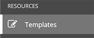

# Demo: Deploy Application

[Click here to return to master demo list](../../README.md#demo-repository)

## Table of Contents

- [Demo: Deploy Application](#demo-deploy-application)
  - [Table of Contents](#table-of-contents)
  - [Objective](#objective)
  - [What business problem is solved?](#what-business-problem-is-solved)
  - [Features show cased](#features-show-cased)
  - [Guide](#guide)

## Objective

Demonstrate managing the VTY ACL on a Cisco router.  

## What business problem is solved?

- **speed to market**:
Reduce the time needed to make changes to Cisco configs.
- **reduce human error**:
Automation of routine manual processes
- **reduce complexity**:
Allows one Network Engineer to update multiple devices at once.  Automate and test once and allow all users access to deploy Ansible Jobs.
- **enforce policy**:
Ansible ensures every device has the same config.  

## Features show cased

- Push button deployment

For description of these and other features of the Red Hat Ansible Automation Platform please refer to the [features README](../features.md)

## Guide

1. Verify rtr1 config

     ssh to rtr1 from the workshop bastion and perform a ***show run*** on the router.   Verify that there is no VTY ACL on the router.

2. Login to Ansible Platform UX

3. Navigate to **Templates**

     

4. Click the rocket next to **Cisco IOS VTY ACL config audit/remediation** to launch the Job

     

5. The job will launch and update the VTY ACL on rtr1.

6. What is happening:

     - Job has started executed in the background.  The user can navigate off this page and the job will continue to execute.
     - On the left is the **Job Details Pane** labeled simply with **DETAILS**.  This information is logged and tells you who, what, when and how.
       - **who** - who launched the job, in this example is the admin user
       - **what** - the project and Ansible Playbook used, and which credential to login to the infrastructure
       - **when** - time stamps for start, end and duration of the job run.
       - **how** - the job status (pass, fail), environment and execution node
     - The larger window on the right is the **Standard Out Pane**.  This provides the same console output the user would be used to on the command-line for troubleshooting purposes.  Some important takeaways to showcase are:
       - aggregate info is at the top including the amount of Plays, tasks, hosts and time duration.
       - this pane can be expanded to take up entire browser window
       - Ansible Playbook can be downloaded for troubleshooting purposes
       - **click on task output** to show them task-by-task JSON output that can be used for troubleshooting or just getting additional information

7. ssh to rtr1 and verify the VTY ACL has been changed.

---
You have finished this demo.  [Click here to return to master demo list](../../README.md#demo-repository)
