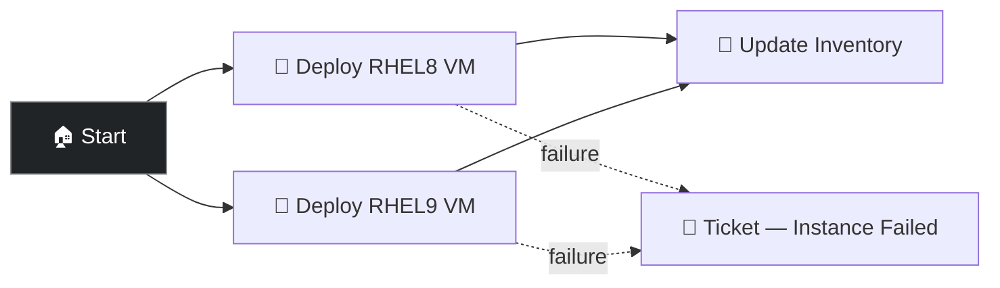

# CNV — Infra Stack

Deploys the full OpenShift CNV infrastructure stack -- installs the OpenShift Virtualization operator, configures cluster settings, provisions RHEL VMs, and syncs the CNV inventory. The OpenShift equivalent of Deploy Cloud Stack in AWS.

## Workflow

1. **Deploy VMs** (parallel) — Provisions RHEL 8 and RHEL 9 VMs on CNV
2. **Update Inventory** — Syncs the CNV dynamic inventory so new VMs appear in AAP
3. **Ticket** (on failure) — Creates a notification if VM deployment fails

## Prerequisites

- **OpenShift Credential** configured with API token
- Cluster admin access with bare-metal or nested-virt nodes
- Run **APD ǀ Single demo setup** with `openshift`

## Job templates

| Template | Playbook | Description |
|----------|----------|-------------|
| OpenShift ǀ CNV ǀ Infra Stack (workflow) | [`openshift/setup.yml`](../setup.yml) | Installs CNV, provisions VMs, and syncs inventory in a single workflow |

## Related demos

| Demo | Description |
|------|-------------|
| ⎈ [CNV — Create RHEL VM](./openshift-cnv-create-vm.md) | Create additional VMs after the stack is deployed |
| 🚀 [Deploy Cloud Stack in AWS](../../cloud/docs/deploy-cloud-stack.md) | The AWS equivalent of this infrastructure workflow |
