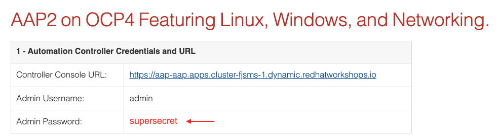

# Windows Demos

## Table of Contents
- [Windows Demos](#windows-demos)
  - [Table of Contents](#table-of-contents)
  - [About These Demos](#about-these-demos)
    - [Known Issues](#known-issues)
    - [Jobs](#jobs)
    - [Workflows](#workflows)
  - [Suggested Usage](#suggested-usage)
  - [Connecting to Windows Hosts \[credssp\]](#connecting-to-windows-hosts-credssp)
    - [Testing with RDP](#testing-with-rdp)
  - [Connecting to Windows Hosts \[kerberos\]](#connecting-to-windows-hosts-kerberos)
    - [Ad-hoc Jobs](#ad-hoc-jobs)
    - [Troubleshooting](#troubleshooting)

## About These Demos
This category of demos shows examples of Windows Server operations and management with Ansible Automation Platform. The list of demos can be found below. See the [Suggested Usage](#suggested-usage) section of this document for recommendations on how to best use these demos.

### Known Issues
We are currently investigating an intermittent connectivity issue related to the credentials for Windows hosts. If encountered, re-provision your demo environment. You can track the issue and related work [here](https://github.com/ansible/product-demos/issues/176).

### Jobs

- [**WINDOWS / Install IIS**](install_iis.yml) - Install IIS feature with a configurable index.html
- [**WINDOWS / Patching**](patching.yml) - Apply Windows updates by category and create report
- [**WINDOWS / Chocolatey install multiple**](windows_choco_multiple.yml) - Install multiple packages using Chocolatey and check versions
- [**WINDOWS / Chocolatey install specific**](windows_choco_specific.yml) - Install a single given package using Chocolatey
- [**WINDOWS / Arbitrary Powershell**](arbitrary_powershell.yml) - Run given Powershell script (default: retrieve cat fact from API)
- [**WINDOWS / Powershell Script**](powershell_script.yml) - Run a Powershell script stored in source control to query services
- [**WINDOWS / Powershell DSC configuring password requirements**](powershell_dsc.yml) - Configure password complexity with Powershell desired state config
- [**WINDOWS / Create Active Directory Domain**](create_ad_domain.yml) - Create a new AD Domain
- [**WINDOWS / Helpdesk new user portal**](helpdesk_new_user_portal.yml) - Create user in AD Domain
- [**WINDOWS / Join Active Directory Domain**](join_ad_domain.yml) - Join computer to AD Domain

### Workflows
- [**Setup Active Directory Domain**](setup_domain_workflow.md) - A workflow to create a domain controller with two domain-joined Windows hosts

## Suggested Usage

**Setup Active Directory Domain** - One-click domain setup, infrastructure included.

**WINDOWS / Create Active Directory Domain** - This job can take some to complete. It is recommended to run ahead of time if you would like to demo creating a helpdesk user.

**WINDOWS / Helpdesk new user portal** - This job is dependant on the Create Active Directory Domain completing before users can be created.

**WINDOWS / Join Active Directory Domain** - This job is dependant on the Create Active Directory Domain completing before computers can be joined.

## Connecting to Windows Hosts \[credssp\]

The provided template for provisioning VMs in AWS supports a few blueprints, notably [windows_core](../cloud/blueprints/windows_core.yml) and [windows_full](../cloud/blueprints/windows_full.yml). The windows blueprints both rely on the [aws_windows_userdata](../collections/ansible_collections/demo/cloud/roles/aws/templates/aws_windows_userdata.j2) script which configures a user with Administrator privileges. By default, the Demo Credential is used to inject a password for `ec2-user`. 

⚠️ When using Ansible Product Demos on demo.redhat.com, 
the image below demonstrates where you can locate the Demo Credential password: 

### Testing with RDP

In the AWS Console, you can follow the steps below to download an RDP configuration for your Windows host:

1. Navigate to the EC2 Dashboard
2. Navigate to Instances
3. Click on the desired Instance ID
4. Click the button to **Connect**
5. Select the **RDP client** tab
6. Click the button to **Download remote desktop file**
7. Use a local RDP client to open the file and connect 
   _Note: the configuration will default to using Administrator as the username, replace with ec2-user_

## Connecting to Windows Hosts \[kerberos\]

In order to demonstrate using Kerberos for connecting to Windows hosts, you must first run the [**Setup Active Directory Domain**](setup_domain_workflow.md) Workflow. One of the final nodes in the workflow, **Kerberos Validation**, leverages Kerberos to connect to each host joined to the domain.

_In the demo environment, our Ansible Automation Platform execution plane does not have discovery or DNS resolution configured for the Domain Controller, so we supply the public ip address for the kdc input in our custom Credential Type. This is NOT recommended for production._

### Ad-hoc Jobs

_Assumes Setup Active Directory Domain Workflow has been run._

During setup, a Job Template called **WINDOWS / Run PowerShell / Kerberos** is created based on the [powershell_script](powershell_script.yml) playbook. The limit is set to kerberos, a group created by the dynamic inventory source attached to **Demo Inventory**. The group variables defined for kerberos, combined with the custom Credential Type attached to this Job Template, will set the appropriate connection variables and krb5.conf to connect via Kerberos and run a PowerShell script on each host.

### Troubleshooting

- If you encounter "no hosts matched", then you have not run the **Setup Active Directory Domain** Workflow. Examine the Demo Inventory and review the keberos group. There should be 3 hosts - dc01, winston, and winthrop.
- If you receive an error similar to `cannot find kdc for realm`, then you have an invalid **Kerberos Credential**. Ensure the kdc input matches the public ip address of your dc01 virtual machine.