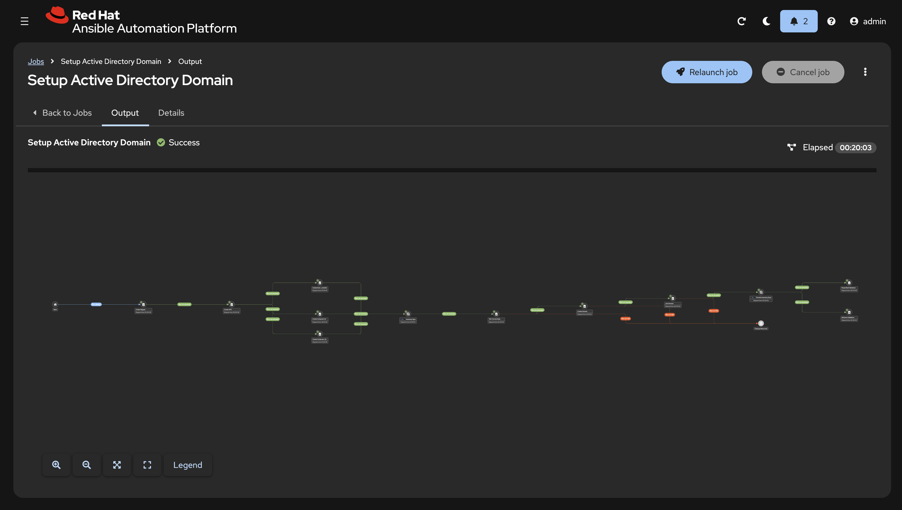
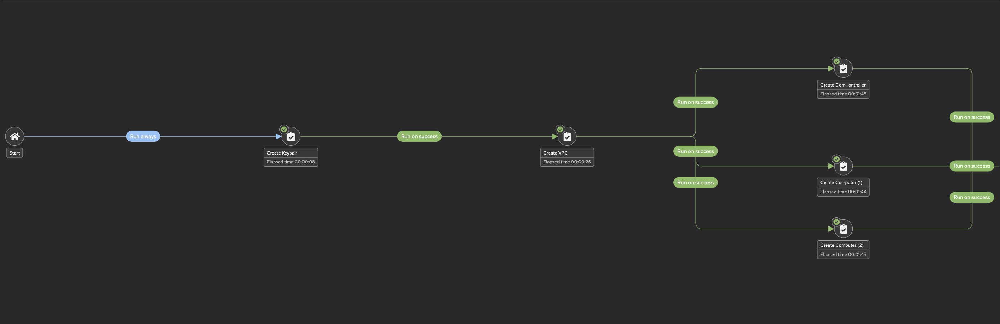
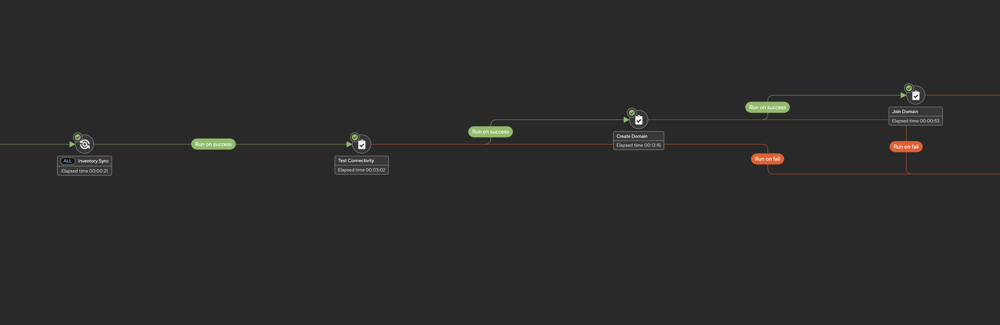
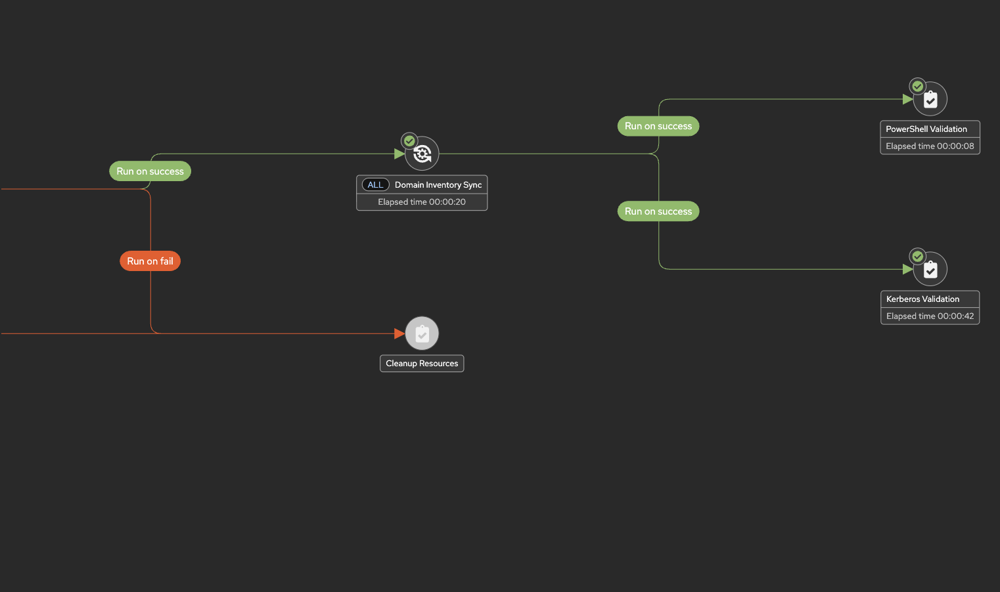

# Setup Active Directory Domain

A workflow to create a domain controller with two domain-joined Windows hosts.

## The Workflow

### High-Level

### Close-Up

## Ansible Inventory

There are additional groups created in the **Demo Inventory** for interacting with different components of the domain:

- **deployment_domain_ansible_local**: all hosts in the domain
- **purpose_domain_controller**: domain controller instances (1)
- **purpose_domain_computer**: domain computers (2)

## Domain (ansible.local)

## PowerShell Validation

In the validation step, you can expect to see the following output based on querying AD computers:

